# Chapter 4 정리: 실험 설계와 결과 해석

작성일: 2026-05-11  
대상 문서: `LateX_Paper/undergraduate-thesis/undergraduate-thesis/chapters/4_chapter4.tex`  
논문 주제: `基于注意力机制的声学信号情绪识别系统`

이 문서는 Chapter 4의 실험 흐름, 전처리 방식, 모델 구조, 결과 수치, 해석 논리, 발표 및 질의응답 시 반드시 이해해야 할 핵심 포인트를 한국어로 정리한 것이다. 핵심 논리는 다음 한 문장으로 요약할 수 있다.

> 본 연구는 log-Mel 스펙트럼 기반 음성 감정 인식에서 CNN, Pure Transformer, CNN-Conformer를 동일한 입력 및 평가 조건으로 비교하고, Pure Transformer의 전역 self-attention만으로는 국소 감정 단서와 비균일한 시간 분포를 안정적으로 반영하기 어렵다는 점을 실험과 문헌으로 확인한 뒤, 국소 convolution과 전역 attention을 결합한 CNN-Conformer가 clean 조건에서 더 높은 성능을 보였음을 제시한다. 다만 noise와 cross-corpus 실험에서는 입력 교란과 도메인 이동에 대한 한계도 함께 확인하였다.

---

## 1. Chapter 4의 전체 위치와 목적

Chapter 4는 앞 장에서 설명한 음성 신호 처리, attention, Transformer, Conformer 이론을 실제 실험으로 검증하는 장이다. 전개 방식은 단순히 모델 성능표를 나열하는 것이 아니라, 모델 구조가 음성 감정 단서를 어떻게 보존하고 집계하는지에 초점을 둔다.

논문상 Chapter 4의 역할은 다음과 같다.

1. 실험 데이터, 입력 표현, 전처리, 평가 지표를 고정한다.
2. `卷积神经网络基线模型`, `纯Transformer模型`, `CNN-Conformer模型`을 같은 조건에서 비교한다.
3. Pure Transformer가 왜 기대만큼 좋지 않았는지 구조적 이유와 실험 증거로 설명한다.
4. CNN-Conformer가 어떤 이론적 근거로 Pure Transformer의 부족한 부분을 보완하는지 설명한다.
5. CNN-Conformer 대표 모델에 대해 구조 최적화, noise 조건, cross-corpus 조건을 추가 분석한다.
6. 최종적으로 clean 조건의 성능, 입력 교란에 대한 민감성, corpus shift에 대한 한계를 함께 정리한다.

### Chapter 4 전체 흐름도

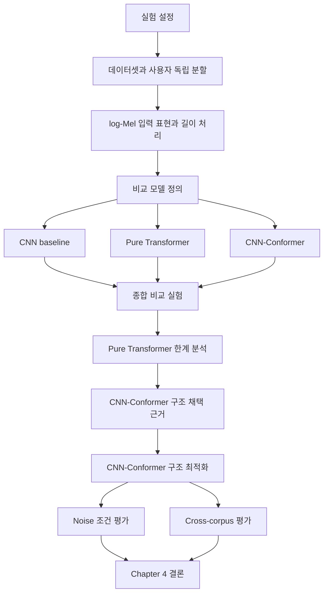

---

## 2. 데이터셋과 task 설정

### 2.1 기본 데이터셋

Chapter 4의 주 실험은 `RAVDESS Speech`를 사용한다. 논문에서 사용하는 기본 설정은 다음과 같다.

| 항목 | 내용 |
| --- | --- |
| 데이터셋 | RAVDESS Speech |
| 사용 부분 | speech audio only |
| 전체 음성 수 | 1440개 |
| 사용자 수 | 24명 |
| 사용자당 샘플 수 | 60개 |
| 감정 클래스 | 8개 |
| 클래스 분포 | 01번 클래스 96개, 나머지 7개 클래스는 각 192개 |
| 분할 방식 | 사용자 독립 분할 |
| 교차 검증 | 5-fold GroupKFold 기반 |
| Optuna 단계 | 일반적으로 fold 1 중심으로 후보 탐색 |

중요한 점은 random split이 아니라 `사용자 단위 분할`을 사용한다는 것이다. 이는 같은 화자의 음성이 train과 validation에 동시에 들어가는 상황을 줄이고, 보지 못한 사용자 음성에 대한 일반화 능력을 보려는 설계다.

### 2.2 왜 사용자 독립 분할을 쓰는가

음성 감정 인식에서는 화자 고유의 음색, 발화 습관, 강세, 말속도 등이 모델에 쉽게 학습될 수 있다. 단순 random split을 사용하면 모델이 감정보다 화자 특성을 활용해 성능을 높일 위험이 있다. 따라서 Chapter 4의 실험은 사용자 단위로 train, validation, test를 분리하여 `未见用户条件`에서의 성능을 관찰한다.

발표할 때는 다음처럼 말하면 된다.

> 본 실험은 단순히 같은 화자의 음성을 다시 맞히는 문제가 아니라, 학습에 참여하지 않은 사용자 음성에서 감정 경계를 얼마나 유지하는지를 보기 위해 사용자 독립 분할을 사용하였다.

---

## 3. 전처리와 입력 표현

### 3.1 기본 입력 표현

세 비교 모델은 모두 `对数梅尔频谱`, 즉 log-Mel spectrogram을 입력으로 사용한다.

| 항목 | 설정 |
| --- | --- |
| 원본 음성 | RAVDESS 16bit, 48kHz mono |
| 학습 시 sampling rate | 16kHz로 통일 |
| feature | log-Mel spectrogram |
| n_fft | 1024 |
| hop_length | 160 |
| mel bands | 80 |
| 주요 chunk 설정 | chunk length 48, stride 12 |

log-Mel을 사용하는 이유는 다음과 같다.

1. 원시 파형보다 입력 차원을 통제하기 쉽다.
2. 서로 다른 모델을 같은 입력 조건에서 비교할 수 있다.
3. 음성의 에너지 분포와 주파수대 차이를 안정적으로 표현한다.
4. 감정과 관련된 음색, 에너지 변화, 주파수대 패턴을 2D time-frequency 형태로 제공한다.

### 3.2 전처리 흐름

논문에서 설명한 전처리 흐름은 다음과 같이 이해하면 된다.


### 3.3 입력 길이가 다른 문제의 처리

음성 데이터는 발화 길이가 서로 다르다. 이 문제를 처리하지 않으면 모델 입력 텐서 크기가 달라져 batch 학습과 비교 실험이 어려워진다. Chapter 4 원문은 이 문제를 `输入长度不一致`라고 설명하고, 이를 처리하기 위해 `分块处理方式`을 사용한다고 적고 있다.

정리 기준에서는 이 `chunk长度/步长 = 48 / 12` 설정을 **세 비교 모델에 동등하게 적용되는 공통 preprocessing/evaluation pipeline**으로 이해한다. 즉 CNN baseline, Pure Transformer, CNN-Conformer는 모두 같은 log-Mel 입력 생성 흐름과 같은 발화 단위 평가 흐름 위에서 비교된다. 모델별 차이는 chunk를 받은 뒤 내부에서 spectrogram을 어떻게 표현하고 집계하는가에 있다.

Chapter 4에서의 공통 길이 처리 방식은 `분할 및 집계`다.

1. 각 발화는 먼저 같은 sampling rate와 같은 log-Mel 추출 설정을 거친다.
2. 발화 길이가 모델 처리 단위보다 길거나 평가 단위와 맞지 않을 때, 공통 chunk 설정에 따라 local segment 단위로 나뉜다.
3. 각 chunk는 동일한 전처리 흐름을 거쳐 해당 모델 입력으로 들어간다.
4. 추론 단계에서는 chunk 단위 출력 또는 logit을 다시 발화 단위로 집계한다.
5. 최종 Accuracy, Macro-F1, UAR은 chunk 단위가 아니라 발화 단위 예측 결과를 기준으로 계산한다.

따라서 발표에서는 “어떤 모델만 따로 chunk를 쓴 것이 아니라, 길이 차이를 통제하기 위한 공통 평가 pipeline으로 chunk 기반 처리를 사용했고, 세 모델은 같은 입력 및 평가 조건 위에서 비교되었다”고 설명하면 된다.

이 방식의 의미는 단순 padding보다 방어적이다. 전체 음성을 하나의 고정 크기로 무리하게 늘이거나 줄이면 시간축의 순간적 감정 단서가 흐려질 수 있다. chunk 기반 처리는 입력 길이 차이를 줄이면서도 국소 변화 정보를 비교적 보존하려는 절충안이다.

### 3.4 공통 log-Mel 설정과 모델별 입력 크기의 관계

Chapter 4에서 말하는 `统一输入表示`는 세 모델이 모두 원시 파형을 직접 받는 것이 아니라 **log-Mel spectrogram 계열의 시주파수 표현을 입력으로 사용한다**는 뜻이다. 다만 이것이 세 모델의 최종 입력 tensor shape까지 완전히 같다는 뜻은 아니다. 원문은 공통 전처리 설정과 모델별 대표 입력 설정을 서로 다른 층위에서 제시한다.

공통 전처리 층위에서는 다음 설정이 제시된다.

| 층위 | 원문 기준 의미 |
| --- | --- |
| sampling rate | 학습 시 16kHz로 통일 |
| n_fft / hop_length | 1024 / 160 |
| log-Mel | 세 모델 모두 사용하는 입력 표현 |
| chunk length / stride | 48 / 12, 주 실험 흐름에서 사용하는 길이 처리 및 평가 단위 |

모델별 대표 설정 층위에서는 다음처럼 서로 다른 항목이 강조된다.

| 모델 | 원문에서 강조한 입력 관련 설정 | 의미 |
| --- | --- | --- |
| CNN baseline | `96 x 512 log-Mel spectrogram` | CNN이 직접 2D feature map으로 처리하는 대표 입력 크기 |
| Pure Transformer | `32 x 32 patch`, `stride 8 x 8` | spectrogram을 patch token sequence로 바꾸는 내부 tokenization 설정 |
| CNN-Conformer | `80维对数梅尔频谱`, `chunk 48/12`, `time block length 4` | 공통 log-Mel 흐름 위에서 full-band time block token을 만드는 설정 |

따라서 `n_fft`, `hop_length`, `mel bands`, `input size`, `patch size`는 같은 종류의 숫자가 아니다. `n_fft`와 `hop_length`는 파형에서 spectrogram을 만들 때 쓰는 신호 처리 파라미터다. `mel bands`는 spectrogram의 주파수축 차원이다. `96 x 512`는 CNN baseline 대표 실험에서 사용한 2D log-Mel 입력 tensor의 높이와 너비다. `32 x 32 patch`는 Pure Transformer가 이미 만들어진 spectrogram을 다시 작은 2D 조각으로 나누는 모델 내부 tokenization 크기다.

이 부분은 다음처럼 구분해서 기억하면 된다.

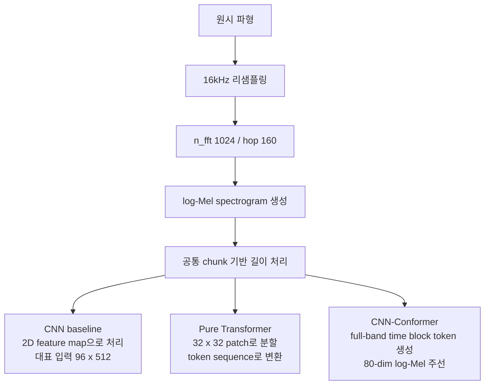

즉 CNN baseline의 `96 x 512`는 “n_fft가 96이고 hop이 512”라는 뜻이 아니다. CNN 대표 구조가 받은 log-Mel 2D 배열의 형태를 말한다. Pure Transformer의 `32 x 32 patch`도 feature extraction 파라미터가 아니라, spectrogram 위에서 잘라낸 local rectangle을 token으로 바꾸는 내부 입력 조직 방식이다.

여기서 가장 헷갈리기 쉬운 점은 `n_mels`와 최종 입력 높이의 관계다. 일반적인 log-Mel 추출만 놓고 보면 `n_mels`는 log-Mel spectrogram의 주파수축 높이가 맞다. 예를 들어 `n_mels = 80`이면 feature extraction 직후의 mel 축은 보통 80개 band로 구성된다. 그러나 모델 입력 단계에서 resize, interpolation, fixed input size, patching 같은 추가 처리가 들어가면 **최종 모델 입력 tensor의 높이**는 `n_mels`와 달라질 수 있다.

Chapter 4 본문도 이 둘을 완전히 같은 숫자로 다루지 않는다. 전처리 표에서는 `梅尔频带数 = 80`을 `CNN-Conformer主线统一`이라고 적고, 모델 비교 표에서는 CNN baseline의 대표 입력을 `$96 \times 512$ 对数梅尔频谱`라고 적는다. 또 모델 탐색 표에서는 CNN baseline에 대해 `输入尺寸`과 `梅尔频带数`를 함께 탐색/설정 항목으로 제시한다. 이 서술 구조는 “mel band 수”와 “최종 입력 크기”가 실험 설정에서 구분되는 항목임을 보여준다.

정리하면 다음과 같다.

| 용어 | 무엇을 정하는가 | 예시 | 비고 |
| --- | --- | --- | --- |
| `n_fft` | STFT window 크기 | 1024 | 주파수 분석 해상도와 관련 |
| `hop_length` | 프레임 간 이동 간격 | 160 | 시간축 프레임 수와 관련 |
| `n_mels` / `梅尔频带数` | Mel filterbank 수, feature extraction 직후 주파수축 크기 | 80 | 보통 log-Mel 높이에 대응 |
| `input size` | 모델이 실제 받는 2D 입력 크기 | 96 x 512 | resize나 fixed-size 처리 후의 shape일 수 있음 |
| `patch size` | 이미 만들어진 spectrogram을 token으로 자르는 내부 window 크기 | 32 x 32 | feature extraction 파라미터가 아님 |

따라서 “n_mels가 입력 높이 아닌가?”라는 질문에 대한 답은 이렇게 정리할 수 있다. **feature extraction 직후에는 맞다. 하지만 논문에서 말하는 모델 대표 입력 크기까지 항상 n_mels와 동일하다고 보면 안 된다.** Chapter 4에서는 CNN baseline의 대표 입력 크기와 CNN-Conformer 주선의 mel band 수를 서로 다른 설정 항목으로 서술하고 있다.

주의할 점은 논문 안에서 세 종류의 "분할"이 등장한다는 것이다.

| 구분 | 의미 |
| --- | --- |
| preprocessing/evaluation chunk | 세 모델에 동등하게 적용되는 공통 길이 처리 및 평가 단위, 대표적으로 48/12 설정 |
| Pure Transformer 2D patch | Pure Transformer 내부에서 spectrogram을 32 x 32 patch, stride 8 x 8로 token화하는 방식 |
| CNN-Conformer time block | 모델 내부에서 시간축을 token으로 만드는 front-end block, 대표 설정은 time block length 4 |

발표할 때 이 셋을 혼동하면 안 된다. `preprocessing/evaluation chunk`는 세 모델 비교의 공통 길이 처리 방식이고, `Pure Transformer 2D patch`와 `CNN-Conformer time block`은 각 모델 내부의 tokenization 방식이다.

---

## 4. 비교 모델의 설계 의도

Chapter 4의 세 모델은 성능 경쟁만을 위한 것이 아니라, 서로 다른 구조적 가설을 검증하기 위한 비교군이다.

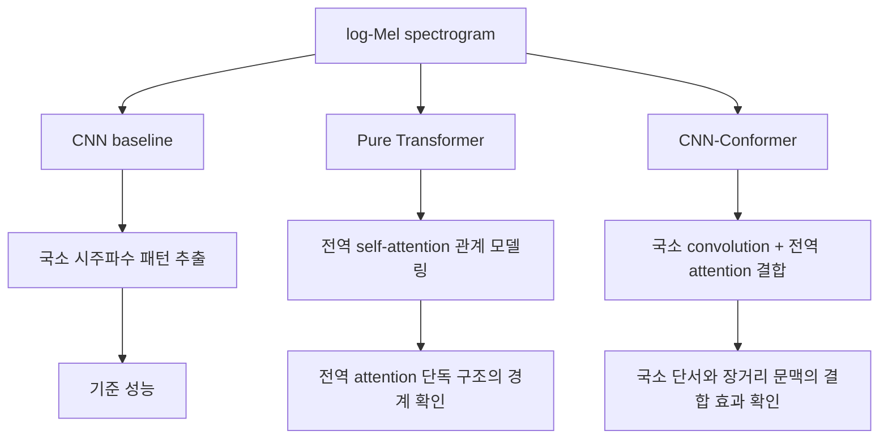

### 4.1 CNN baseline

CNN baseline은 가장 기본적인 참조 모델이다. log-Mel spectrogram을 2D 이미지처럼 보고, convolution block으로 국소 시주파수 패턴을 추출한다.

대표 설정은 다음과 같다.

| 항목 | 설정 |
| --- | --- |
| 입력 | 96 x 512 log-Mel spectrogram |
| convolution blocks | 4개 |
| channels | [32, 64, 256, 512] |
| 각 block | 3x3 Conv, BatchNorm, ReLU, 2x2 MaxPool |
| pooling | AdaptiveAvgPool2d, 4 x 4 |
| dropout | 0.33238 |
| classifier | flatten 후 linear classifier |
| parameter count | 1.41M |

#### CNN baseline 구조 흐름

```mermaid
flowchart LR
    A[공통 chunk 기반 log-Mel 입력] --> B[96 x 512 log-Mel spectrogram]
    B --> C[Conv Block 1<br/>3x3 Conv + BN + ReLU + MaxPool<br/>32 channels]
    C --> D[Conv Block 2<br/>3x3 Conv + BN + ReLU + MaxPool<br/>64 channels]
    D --> E[Conv Block 3<br/>3x3 Conv + BN + ReLU + MaxPool<br/>256 channels]
    E --> F[Conv Block 4<br/>3x3 Conv + BN + ReLU + MaxPool<br/>512 channels]
    F --> G[AdaptiveAvgPool2d<br/>4 x 4]
    G --> H[Flatten]
    H --> I[Dropout 0.33238]
    I --> J[Linear classifier]
    J --> K[8-class emotion output]
```

CNN baseline에서 `96 x 512` 입력 크기가 명시된 이유는 이 모델이 spectrogram을 2D feature map으로 직접 받아 convolution과 pooling을 수행하기 때문이다. 즉 CNN baseline은 입력 feature map의 공간 크기와 pooling 이후 고정 표현 크기를 표에 명시하는 것이 구조 이해에 중요하다.

다만 Chapter 4 원문만 기준으로 보면, `96 x 512`가 “모든 원본 음성을 이 크기로 직접 강제 변환했다”는 절차를 상세히 설명하는 문장은 없다. 원문은 대표 설정 표에서 CNN baseline의 입력을 `96 x 512 log-Mel spectrogram`으로 제시하고, 동시에 공통 전처리 절에서는 입력 길이 차이를 `chunk长度/步长 = 48 / 12`의 분块 처리와 추론 단계 집계로 다룬다고 설명한다. 따라서 정리할 때는 다음처럼 말하는 것이 가장 안전하다.

> CNN baseline의 대표 실험은 2D log-Mel feature map을 입력으로 사용하며, 논문 표에서는 그 대표 입력 크기를 `96 x 512`로 제시한다. 길이 차이에 대한 전체 pipeline 차원의 처리는 공통 chunk 기반 처리와 추론 집계로 설명되어 있고, CNN 내부에서는 convolution 이후 AdaptiveAvgPool2d가 고정 크기 표현을 만든다.

CNN baseline의 의미는 다음과 같다.

1. 감정 단서 중 에너지 변화, 국소 주파수대 패턴, 시주파수 texture를 잘 잡을 수 있다.
2. 작은 데이터 조건에서 안정적인 local inductive bias를 제공한다.
3. 이후 Transformer 계열 모델이 실제로 더 좋은지 비교하는 기준선이 된다.

### 4.2 Pure Transformer

Pure Transformer는 convolution front-end 없이 spectrogram을 patch 단위로 나누고, 이를 sequence token으로 변환한 뒤 encoder를 통과시킨다.

대표 설정은 다음과 같다.

| 항목 | 설정 |
| --- | --- |
| patch size | 32 x 32 |
| patch stride | 8 x 8 |
| embedding dim | 256 |
| encoder layers | 5 |
| attention heads | 4 |
| FFN dim | 1024 |
| pooling | mean pooling |
| dropout | 0.2707 |
| parameter count | 4.21M |

#### Pure Transformer 구조 흐름

```mermaid
flowchart LR
    A[공통 chunk 기반 log-Mel 입력] --> B[log-Mel spectrogram]
    B --> C[2D patch embedding<br/>patch 32 x 32<br/>stride 8 x 8]
    C --> D[token sequence]
    D --> E[position encoding]
    E --> F[Transformer Encoder x5]
    F --> F1[Multi-head self-attention<br/>4 heads]
    F1 --> F2[Feed-forward network<br/>dim 1024]
    F2 --> G[mean pooling]
    G --> H[Dropout 0.2707]
    H --> I[Linear classifier]
    I --> J[8-class emotion output]
```

Pure Transformer 표에서 CNN baseline처럼 `96 x 512` 형태의 전체 입력 크기가 따로 강조되지 않은 이유는, Chapter 4 원문이 Pure Transformer의 핵심 입력 설정을 **전체 spectrogram 크기**보다 **patch tokenization 방식**으로 설명하기 때문이다. 원문은 Pure Transformer 대표 설정을 `二维分块尺寸 32 x 32`, `二维分块步长 8 x 8`, `嵌入维度 256`, `编码层数 5`로 제시한다. 이 모델에서 중요한 구조 차이는 spectrogram 전체를 고정 feature map으로 직접 처리하는 것이 아니라, 2D patch를 sequence token으로 바꾸어 self-attention encoder에 넣는다는 점이다.

따라서 CNN baseline에는 `96 x 512 log-Mel`이 명시되고, Pure Transformer에는 `32 x 32 patch, stride 8 x 8`이 명시된다. 둘 다 같은 공통 log-Mel preprocessing/evaluation pipeline 위에 있지만, 논문은 모델별 핵심 구조 차이를 보여주기 위해 서로 다른 입력 관련 항목을 강조한다.

Pure Transformer에서 말하는 `patch`는 spectrogram 위의 작은 2D 사각형 조각이다. 예를 들어 log-Mel spectrogram을 시간축과 주파수축을 가진 하나의 2D 배열로 보면, `32 x 32 patch`는 이 배열에서 높이 32, 너비 32에 해당하는 local region이다. `stride 8 x 8`은 이 patch window를 주파수축과 시간축 방향으로 8칸씩 이동시키며 여러 patch를 만든다는 뜻이다. 이렇게 만들어진 각 patch는 flatten 또는 projection을 거쳐 하나의 vector가 되고, 이 vector가 Transformer에 들어가는 하나의 `token`이 된다.

Pure Transformer의 tokenization 흐름은 다음처럼 이해하면 된다.

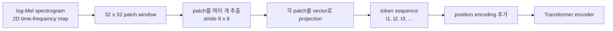

이 때문에 Pure Transformer는 CNN baseline과 달리 전체 spectrogram을 convolution feature map으로 바로 처리하지 않는다. 먼저 spectrogram을 patch 단위로 쪼개고, 각 patch를 하나의 sequence token으로 바꾼 뒤, self-attention으로 token 사이의 관계를 학습한다. Chapter 4에서 Pure Transformer의 한계로 “二维时频邻接关系在分块展平后需要在序列表示中重新学习”이라고 설명한 부분이 바로 이 과정을 가리킨다.

patch embedding은 CNN과 어느 정도 비슷하게 볼 수 있다. spectrogram 위에서 일정 크기의 window를 움직이며 local region을 projection한다는 점은 convolution과 유사하다. 실제 구현에서도 patch embedding은 convolution 형태로 만들 수 있다. 그러나 목적은 일반 CNN처럼 여러 convolution block을 쌓아 local feature hierarchy를 만드는 것이 아니라, **각 patch를 Transformer encoder가 처리할 sequence token으로 바꾸는 것**이다. 그래서 Pure Transformer의 patch embedding은 “CNN feature extractor”라기보다 “2D spectrogram을 token sequence로 변환하는 입력 변환층”으로 이해하는 것이 더 정확하다.

Pure Transformer의 장점은 멀리 떨어진 시간 위치 간 관계를 직접 모델링할 수 있다는 것이다. 그러나 본 연구에서는 이 장점이 곧바로 SER 성능으로 이어지지 않았다.

### 4.3 CNN-Conformer

CNN-Conformer는 Pure Transformer의 전역 attention 능력을 유지하면서, convolution module을 통해 local temporal dynamics를 보완하는 구조다.

대표 설정은 다음과 같다.

| 항목 | 설정 |
| --- | --- |
| front-end | 무卷积前端 시간 분할 입력 |
| time block length | 4 |
| embedding dim | 192 |
| Conformer encoder layers | 4 |
| attention heads | 8 |
| FFN dim | 768 |
| convolution kernel size | 31 |
| pooling | attention pooling |
| augmentation | mixup alpha = 0.4 |
| classifier | dropout + linear |
| parameter count | 3.55M |

#### CNN-Conformer 구조 흐름

```mermaid
flowchart LR
    A[공통 chunk 기반 log-Mel 입력] --> B[80-dim log-Mel spectrogram]
    B --> C[무卷积前端 시간 분할 입력<br/>time block length 4]
    C --> D[full-band time block tokens]
    D --> E[LayerNorm + Linear projection<br/>embedding dim 192]
    E --> F[Conformer Encoder x4]
    F --> F1[1/2 FFN<br/>dim 768]
    F1 --> F2[Relative MHSA<br/>8 heads]
    F2 --> F3[Convolution module<br/>kernel size 31]
    F3 --> F4[1/2 FFN + LayerNorm]
    F4 --> G[Attention pooling]
    G --> H[Dropout]
    H --> I[Linear classifier]
    I --> J[8-class emotion output]
```

CNN-Conformer는 Pure Transformer처럼 sequence encoder를 사용하지만, 입력 token을 만드는 방식과 encoder block 내부가 다르다. Pure Transformer는 2D patch를 잘라 sequence token을 만들고 mean pooling을 사용한다. CNN-Conformer는 full mel band를 포함하는 시간 block을 token으로 만들고, Conformer encoder 안에서 relative self-attention과 convolution module을 함께 사용하며, 마지막에는 attention pooling으로 발화 단위 표현을 만든다.

---

## 5. Pure Transformer가 약했던 이유

Pure Transformer에 대한 논문상 분석은 박사 피드백의 핵심 질문인 “왜 pure Transformer가 좋지 않은가, 무엇을 보지 못했는가”에 대응한다.

### 5.1 구조적 한계

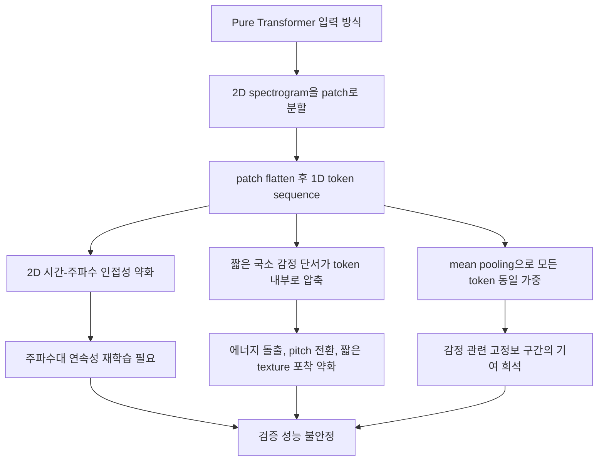

Pure Transformer의 한계는 세 가지로 정리된다.

1. 입력 조직 문제  
   log-Mel spectrogram은 시간축과 주파수축이 동시에 의미를 갖는다. 그러나 2D patch를 flatten하면 원래의 시주파수 인접성이 sequence 위치 관계로 바뀐다. 모델은 이 관계를 후속 attention layer에서 다시 학습해야 한다.

2. 국소 단서 압축 문제  
   감정 단서는 짧은 energy burst, pitch turning point, local frequency change처럼 짧은 구간에 나타날 수 있다. patch embedding 단계에서 이러한 변화가 하나의 token 안으로 압축되면 후속 attention은 token 간 관계를 보더라도 token 내부의 세밀한 변화를 직접 복원하기 어렵다.

3. sentence-level aggregation 문제  
   대표 Pure Transformer는 mean pooling을 사용한다. 하지만 감정 단서는 발화 전체에 균등하게 분포하지 않는다. 일부 구간이 더 중요할 수 있는데, mean pooling은 모든 token에 같은 가중치를 부여하므로 high-information segment가 희석될 수 있다.

### 5.2 외부 문헌 근거

논문은 Pure Transformer 한계를 단순한 개인 판단으로 두지 않고, 관련 연구와 연결한다.

| 참고 문헌 | 논문에서 사용한 의미 |
| --- | --- |
| Vaswani et al., 2017 | Transformer와 self-attention의 기본 구조 근거 |
| Chen et al., 2023, DWFormer | SER에서 감정 관련 시간 영역이 여러 local position과 scale에 분산될 수 있음을 뒷받침 |
| Wang et al., 2024, Speech Swin-Transformer | local window, shifted window, hierarchical aggregation이 SER에 필요하다는 방향 제시 |

즉 SER에서 Transformer를 쓰더라도, 단순 전역 attention만으로 충분하지 않고 local temporal structure와 hierarchical acoustic cue를 함께 다뤄야 한다는 근거가 있다.

### 5.3 실험 근거

Pure Transformer는 다음 결과를 보였다.

| 모델 | Accuracy | Macro-F1 | UAR | Params |
| --- | ---: | ---: | ---: | ---: |
| Pure Transformer | 0.52000 | 0.51163 | 0.51250 | 4.21M |

중요한 해석은 다음과 같다.

1. 파라미터 수는 4.21M으로 CNN-Conformer보다 많다.
2. 그러나 Accuracy, Macro-F1, UAR 모두 CNN baseline과 CNN-Conformer보다 낮다.
3. 따라서 성능 부족을 단순히 모델 크기 부족으로 설명할 수 없다.
4. 구조가 SER의 국소 감정 단서와 맞는 inductive bias를 충분히 제공하지 못했다고 해석할 수 있다.

추가 실험 artifact도 Pure Transformer의 한계를 보강한다.

| artifact | 해석 |
| --- | --- |
| learning curve | train 성능은 상승하지만 validation 성능은 안정적으로 동반 상승하지 않음 |
| calibration curve | ECE 0.29362, confidence와 실제 정답률 사이 불일치 |
| confusion matrix | `sad -> disgust 0.28`, `fearful -> happy 0.33`, `disgust -> angry 0.23` 등 혼동 |

발표용 표현:

> Pure Transformer는 전역 attention을 통해 장거리 관계를 볼 수 있지만, 현재 SER 설정에서는 짧은 국소 음향 변화와 감정 관련 구간의 비균일한 중요도를 충분히 안정적으로 반영하지 못했다. 이 판단은 성능표, learning curve, calibration curve, confusion matrix, 그리고 DWFormer 및 Speech Swin-Transformer의 구조 개선 방향과 함께 뒷받침된다.

---

## 6. CNN-Conformer의 이론적 근거와 구조

### 6.1 원본 Conformer의 설계 동기

원본 Conformer는 ASR 과제를 위해 제안되었다. 핵심 동기는 self-attention의 long-range dependency modeling과 convolution의 local feature modeling을 하나의 encoder block 안에 결합하는 것이다.

원본 Conformer 논문은 LibriSpeech ASR 기준에서 다음과 같은 결과를 보고한다.

| 조건 | test WER | test-other WER |
| --- | ---: | ---: |
| without external LM | 2.1% | 4.3% |
| with external LM | 1.9% | 3.9% |
| 10M small setting | 2.7% | 6.3% |

논문에서는 이 WER 수치를 SER 성능으로 직접 외삽하지 않는다. 인용 목적은 Conformer가 음성 sequence에서 local dynamics와 global context를 함께 모델링하는 구조적 근거를 갖는다는 점을 설명하기 위한 것이다.

### 6.2 본 연구의 CNN-Conformer는 원본과 무엇이 다른가

| 항목 | 원본 Conformer | 본 연구 CNN-Conformer |
| --- | --- | --- |
| 주요 task | ASR |
| 본 연구 task | 8-class speech emotion classification |
| 출력 | 문자 또는 subword sequence |
| 본 연구 출력 | emotion class |
| 평가 지표 | WER |
| 본 연구 지표 | Accuracy, Macro-F1, UAR, ECE |
| front-end | ASR식 convolution subsampling 사용 가능 |
| 본 연구 front-end | 무卷积前端 시간 분할 입력 |
| 목적 | 음성-문자 alignment와 인식 |
| 본 연구 목적 | 발화 단위 비언어적 감정 단서의 분류 |

본 연구에서 원본 ASR식 convolution stem을 그대로 쓰지 않은 이유는, 중소규모 SER에서 너무 이른 시점의 강한 압축이 감정 관련 frequency structure와 local temporal cue를 손상시킬 수 있기 때문이다.

### 6.3 Conformer block 계산 흐름

논문에 들어간 Conformer block 계산 흐름은 다음과 같다.


수식으로는 다음 흐름이다.

```text
x1 = x + 1/2 FFN(x)
x2 = x1 + MHSA(x1)
x3 = x2 + Conv(x2)
y  = LayerNorm(x3 + 1/2 FFN(x3))
```

각 구성 요소의 의미는 다음과 같다.

| 구성 요소 | 역할 |
| --- | --- |
| FFN | 각 time position 내부의 channel representation 변환 |
| MHSA | 서로 다른 시간 token 사이의 long-range relation 모델링 |
| Conv module | 인접 time token 사이의 local dynamics 모델링 |
| Residual connection | 입력 표현 보존, deep stack 안정화 |
| LayerNorm | scale 안정화 |
| Macaron-style half residual | 두 FFN branch가 representation을 과도하게 바꾸지 않도록 균형 조절 |

### 6.4 CNN-Conformer 전체 구조

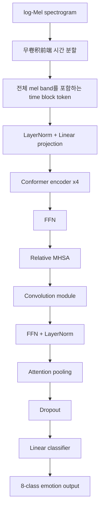

CNN-Conformer가 Pure Transformer의 부족한 점에 대응하는 방식은 다음과 같다.

| Pure Transformer의 문제 | CNN-Conformer의 대응 |
| --- | --- |
| 2D patch flatten으로 시주파수 구조 약화 | 전체 mel band를 포함하는 time block token 사용 |
| 국소 temporal cue가 patch embedding에서 압축 | Conformer convolution module로 인접 시간 변화 모델링 |
| mean pooling으로 중요 구간 희석 | attention pooling으로 시간 token별 중요도 학습 |
| 중소규모 데이터에서 overfitting 가능 | mixup alpha=0.4, dropout, LayerNorm 등 사용 |
| 전역 attention 중심 | relative MHSA + convolution의 local/global 결합 |

---

## 7. 훈련 설정과 평가 지표

### 7.1 훈련 및 구현 환경

| 항목 | 설정 |
| --- | --- |
| OS | Windows 10 |
| Python | Python 3.13 계열 |
| Framework | PyTorch, torchaudio |
| Config | Hydra, OmegaConf |
| Search/Logging | Optuna, MLflow |
| GPU | NVIDIA GeForce RTX 2060 single card |
| Optimizer | AdamW 계열 설정 |
| Learning rate | 1e-4 계열 중심 |
| Batch size | 12 또는 16 |
| Epoch | 30 |
| Early stopping | patience 10 |
| Model selection | validation Macro-F1 기준 |

### 7.2 평가 지표

| 지표 | 의미 |
| --- | --- |
| Accuracy | 전체 샘플 중 정답 비율 |
| Macro-F1 | 클래스별 F1을 평균, class imbalance에 더 민감 |
| UAR | 클래스별 recall 평균, 감정 클래스별 균형성 확인 |
| ECE | confidence calibration error, cross-corpus와 calibration 분석에 사용 |

Accuracy만 보면 다수 클래스 또는 쉬운 클래스에 의해 결과가 좋아 보일 수 있다. 따라서 논문은 Macro-F1과 UAR을 함께 사용한다.

---

## 8. 종합 실험 결과

### 8.1 모델별 대표 설정

| 모델 | 입력 및 front-end | main structure | pooling/classification |
| --- | --- | --- | --- |
| CNN baseline | 96 x 512 log-Mel | 4 conv blocks, channels [32,64,256,512] | adaptive avg pooling, dropout 0.33238, linear |
| Pure Transformer | 32 x 32 patch, stride 8 x 8 | 5 encoder layers, 256 dim, 4 heads | mean pooling, dropout 0.2707, linear |
| CNN-Conformer | no-stem time patch, time block length 4 | 4 encoders, 192 dim, 8 heads, conv kernel 31 | attention pooling, mixup alpha 0.4, linear |

### 8.2 종합 결과

| 모델 | Accuracy | Macro-F1 | UAR | Params | 해석 |
| --- | ---: | ---: | ---: | ---: | --- |
| CNN baseline | 0.61667 | 0.62196 | 0.61563 | 1.41M | 단순하지만 안정적인 local baseline |
| Pure Transformer | 0.52000 | 0.51163 | 0.51250 | 4.21M | 전역 attention 단독 구조의 한계 |
| CNN-Conformer | 0.70000 | 0.70563 | 0.70938 | 3.55M | local/global 결합 구조의 대표 고성능 |

핵심 해석:

1. CNN baseline은 여전히 강한 기준선이다.
2. Pure Transformer는 parameter가 더 많아도 더 낮은 성능을 보였다.
3. CNN-Conformer는 parameter가 Pure Transformer보다 적지만 더 높은 Macro-F1과 UAR을 보였다.
4. 따라서 단순한 모델 규모보다, SER task에 맞는 local/global inductive bias가 더 중요하다는 해석이 가능하다.

---

## 9. CNN-Conformer 구조 최적화 흐름

CNN-Conformer는 단일 실험으로 완성된 것이 아니라 여러 구조와 훈련 전략을 비교하며 대표 설정을 정했다.

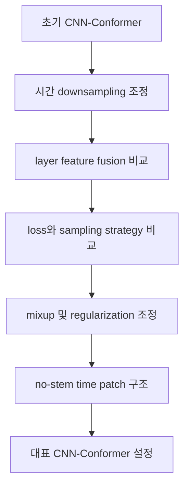

### 9.1 단계별 결과

| 단계 | 핵심 설정 | Accuracy | Macro-F1 | 결론 |
| --- | --- | ---: | ---: | --- |
| 초기 구조 | two-stage conv front-end, relative Conformer | 0.63000 | 0.63168 | 초기 baseline |
| 시간 downsampling | 시간 해상도 더 보존 | 0.62017 | 0.62017 | baseline 초과 실패 |
| layer fusion | last output vs weighted fusion | 0.55348 | 0.55348 | 수익 제한 |
| training strategy | loss, sampling, mixup | 0.70000 | 0.70563 | 대표 고성능 |
| backbone regularization | no-stem time patch, norm screening | 0.70333 | 0.70042 | 최종 대표와 근접 |

핵심은 “구조를 무조건 키운다”가 아니다. 시간 해상도, pooling 방식, regularization, capacity control의 균형이 중요하다.

---

## 10. Noise 조건 실험

### 10.1 실험 목적

Noise 실험은 모델을 다시 학습하지 않는다. clean 조건에서 선택한 CNN-Conformer 대표 모델을 고정하고, 평가 입력 파형에만 noise를 추가한다.

목적은 다음 두 가지다.

1. clean 조건에서 높은 성능을 보인 모델이 입력 품질이 변해도 안정적인가.
2. noise의 frequency shape와 temporal structure에 따라 성능 저하 경로가 달라지는가.

### 10.2 Noise 실험 흐름

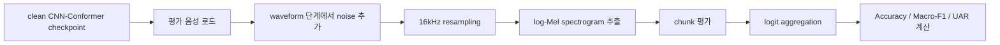

### 10.3 Noise 종류

| Noise type | 구성 방식 | 관찰 목적 |
| --- | --- | --- |
| white | Gaussian random sequence, flat spectrum | wide-band random interference |
| pink | 1/f frequency decay, low-frequency emphasis | low-frequency continuous coverage |
| babble | speech waveform shift, scale, overlap, colored noise | speech-like background interference |
| synthetic-mixed | pink/brown noise + transient pulses | continuous + transient mixed disturbance |

### 10.4 Noise 실험 결과

| noise | SNR | Accuracy | Macro-F1 | UAR | Accuracy 변화 |
| --- | --- | ---: | ---: | ---: | ---: |
| clean | clean | 0.70333 | 0.70042 | 0.70000 | 0.00000 |
| white | 20 | 0.61000 | 0.56389 | 0.57812 | -0.09333 |
| white | 10 | 0.49000 | 0.44717 | 0.46562 | -0.21333 |
| white | 5 | 0.40667 | 0.32933 | 0.38125 | -0.29667 |
| white | 0 | 0.34000 | 0.24169 | 0.31875 | -0.36333 |
| white | -5 | 0.29333 | 0.17877 | 0.27500 | -0.41000 |
| pink | 20 | 0.60000 | 0.58425 | 0.58125 | -0.10333 |
| pink | 10 | 0.36667 | 0.32255 | 0.34688 | -0.33667 |
| pink | 5 | 0.27000 | 0.19737 | 0.25312 | -0.43333 |
| pink | 0 | 0.21000 | 0.13333 | 0.19688 | -0.49333 |
| pink | -5 | 0.15000 | 0.06243 | 0.14062 | -0.55333 |
| babble | 20 | 0.59667 | 0.57407 | 0.57500 | -0.10667 |
| babble | 10 | 0.54667 | 0.52658 | 0.52500 | -0.15667 |
| babble | 5 | 0.51667 | 0.49893 | 0.49687 | -0.18667 |
| babble | 0 | 0.45333 | 0.43736 | 0.43438 | -0.25000 |
| babble | -5 | 0.44333 | 0.42124 | 0.42188 | -0.26000 |
| synthetic-mixed | 20 | 0.63667 | 0.63597 | 0.62500 | -0.06667 |
| synthetic-mixed | 10 | 0.58667 | 0.58083 | 0.57188 | -0.11667 |
| synthetic-mixed | 5 | 0.55667 | 0.55418 | 0.54688 | -0.14667 |
| synthetic-mixed | 0 | 0.45333 | 0.44479 | 0.43750 | -0.25000 |
| synthetic-mixed | -5 | 0.34000 | 0.30379 | 0.32500 | -0.36333 |

### 10.5 Noise 결과 해석

핵심 관찰은 다음과 같다.

1. 20dB의 가벼운 noise에서도 네 종류 모두 성능 저하가 나타난다.
2. pink noise는 10dB 이하에서 빠르게 악화된다.
3. -5dB pink noise는 Accuracy 0.15000, Macro-F1 0.06243으로 가장 큰 하락을 보인다.
4. babble은 -5dB에서도 Accuracy 0.44333, Macro-F1 0.42124를 유지한다.
5. synthetic-mixed는 20, 10, 5dB에서 비교적 완만히 하락하다가 0dB 이하에서 하락 폭이 커진다.

구조적 해석:

CNN-Conformer는 time block token을 만든 뒤 Conformer encoder에서 local/global cue를 결합한다. 그런데 pink noise처럼 저주파 지속 성분이 강하게 들어오면, time block token의 energy contour가 초기부터 왜곡된다. 이 경우 Conformer의 convolution과 self-attention도 충분한 감정 단서를 얻기 어렵다.

따라서 clean 성능이 높다고 noise robustness가 자동으로 보장되는 것은 아니다.

---

## 11. Cross-corpus 실험

### 11.1 실험 목적

Cross-corpus 실험은 같은 모델이 다른 corpus distribution에서도 안정적인지 확인하기 위한 보충 실험이다.

주 실험은 train과 validation이 모두 RAVDESS 내부에서 이루어진다. 이 경우 같은 corpus 안의 일반화는 볼 수 있지만, 녹음 조건, 화자 수, 문장 구성, 감정 표현 방식이 달라지는 상황은 볼 수 없다.

그래서 RAVDESS를 source corpus, CREMA-D를 target corpus로 설정한다.

### 11.2 Cross-corpus 실험 흐름

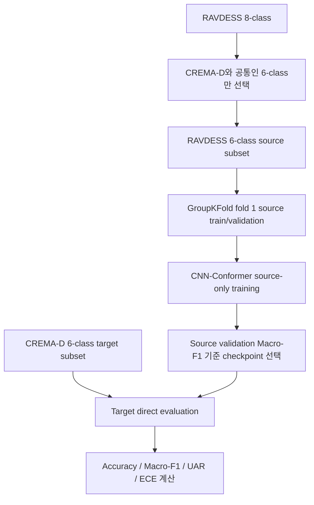

### 11.3 Cross-corpus 설정

| 항목 | 설정 |
| --- | --- |
| source corpus | RAVDESS 6-class subset |
| source size | 1056개, 24명 |
| target corpus | CREMA-D 6-class subset |
| target size | 7442개, 91명 |
| common classes | neutral, happy, sad, angry, fearful, disgust |
| training | source-only |
| split | GroupKFold fold 1 |
| model | CNN-Conformer 대표 설정 |
| classifier | 8-class가 아니라 6-class 출력으로 재구성 |
| target 사용 | fine-tuning, calibration, early stopping에 사용하지 않음 |

중요한 방어 포인트:

> Cross-corpus 실험에서 target data는 모델 선택이나 학습에 쓰지 않았다. 따라서 결과는 target adaptation 결과가 아니라 source-only baseline observation이다.

### 11.4 Cross-corpus 결과

| 평가 집합 | 대표 epoch | Accuracy | Macro-F1 | UAR | ECE |
| --- | ---: | ---: | ---: | ---: | ---: |
| RAVDESS source validation | 20 | 0.58182 | 0.56897 | 0.58333 | 0.22191 |
| CREMA-D target corpus | 20 | 0.19377 | 0.09243 | 0.18936 | 0.56109 |

해석:

1. source validation에서는 여전히 어느 정도 6-class 감정 경계가 형성된다.
2. target corpus로 옮기면 Accuracy, Macro-F1, UAR이 모두 크게 낮아진다.
3. ECE도 0.22191에서 0.56109로 커진다.
4. 이는 단순 성능 하락이 아니라 confidence calibration도 target corpus에서 무너졌다는 뜻이다.

### 11.5 Cross-corpus 결과의 정확한 의미

이 결과는 CNN-Conformer 자체가 무효라는 뜻이 아니다. 정확한 의미는 다음과 같다.

1. source-only CNN-Conformer는 RAVDESS에서 CREMA-D로 직접 이전될 때 generalization이 약하다.
2. RAVDESS와 CREMA-D 사이에는 녹음 조건, 화자 수, 문장 구성, 감정 표현 강도 차이가 있다.
3. RAVDESS에서 학습한 decision boundary가 CREMA-D로 안정적으로 이전되지 않았다.
4. 완전한 5-fold 결과가 아니므로, 과도한 결론을 내리면 안 된다.
5. domain adaptation, domain-invariant learning, adversarial domain generalization 같은 후속 전략이 필요할 수 있다.

---

## 12. Chapter 4의 논리 연결

논문 전체 논리는 다음처럼 연결된다.

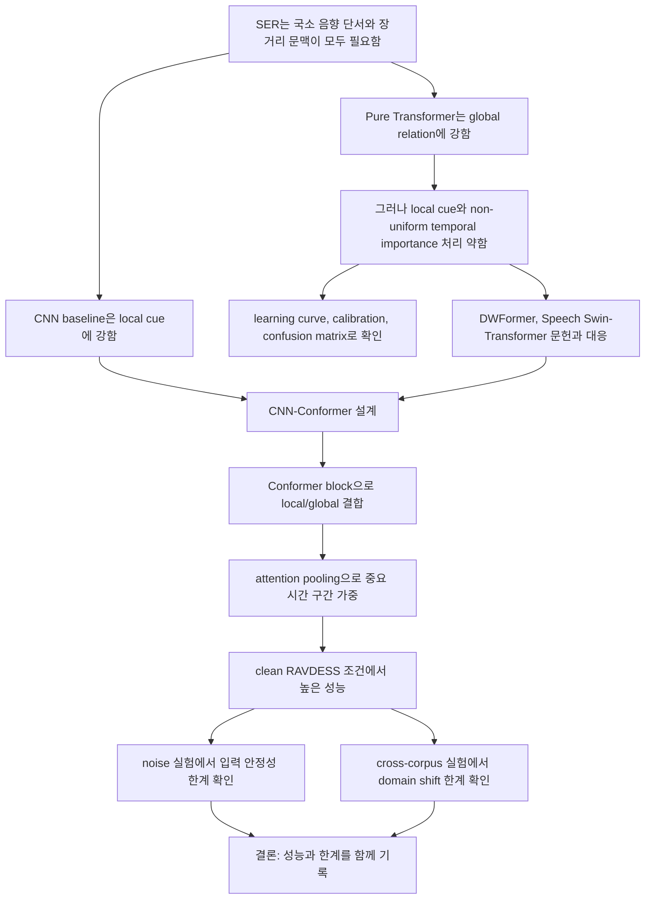

Chapter 4의 결론은 한 방향으로만 주장하지 않는다.

1. CNN-Conformer는 clean same-corpus 조건에서 좋은 성능을 보인다.
2. Pure Transformer보다 구조적으로 SER에 더 잘 맞는 부분이 있다.
3. 하지만 noise와 corpus shift에서는 여전히 불안정하다.
4. 따라서 후속 연구 방향은 noise augmentation, robust training, domain-invariant learning, target adaptation이다.

---

## 13. 발표 및 질의응답용 핵심 키워드

### 13.1 반드시 알아야 할 중국어 용어

| 중국어 표현 | 한국어 의미 |
| --- | --- |
| 语音情绪识别 | 음성 감정 인식 |
| 声学信号 | 음향 신호 |
| 对数梅尔频谱 | log-Mel spectrogram |
| 用户无关划分 | 사용자 독립 분할 |
| 卷积神经网络基线模型 | CNN baseline |
| 纯Transformer模型 | Pure Transformer model |
| CNN-Conformer模型 | CNN-Conformer model |
| 无卷积前端时间分块输入 | convolution stem 없는 시간 분할 입력 |
| 相对位置多头自注意力 | relative positional multi-head self-attention |
| 注意力池化 | attention pooling |
| 混合增强 | mixup augmentation |
| 跨语料库实验 | cross-corpus experiment |
| 源语料 | source corpus |
| 目标语料 | target corpus |
| 置信度校准误差 | expected calibration error, ECE |

### 13.2 질문별 답변 골격

#### Q1. 왜 raw waveform이 아니라 log-Mel을 썼나

log-Mel은 음성의 시간-주파수 구조와 에너지 분포를 안정적으로 표현한다. 현재 데이터 규모에서는 raw waveform end-to-end 학습보다 입력 차원 통제가 쉽고, CNN, Transformer, CNN-Conformer를 같은 feature 조건에서 비교하기 좋다.

#### Q2. 입력 길이가 다르면 어떻게 처리했나

발화 길이가 다르기 때문에 chunk 기반 처리를 사용했다. 긴 발화를 여러 local segment로 나누고, 추론 단계에서 chunk 결과를 발화 단위로 집계한다. 이렇게 하면 고정 입력 요구를 만족하면서도 전체 발화를 강제로 늘이거나 줄이는 데서 생길 수 있는 정보 손실을 줄일 수 있다.

#### Q3. 왜 Pure Transformer가 약했나

Pure Transformer는 장거리 관계를 잘 볼 수 있지만, 본 task에서는 2D 시주파수 인접성, 짧은 국소 감정 단서, 감정 관련 segment의 비균일한 중요도를 충분히 안정적으로 처리하지 못했다. 이 판단은 성능표, learning curve, calibration curve, confusion matrix, 그리고 DWFormer와 Speech Swin-Transformer의 구조 개선 방향으로 뒷받침된다.

#### Q4. CNN-Conformer는 Pure Transformer와 무엇이 다른가

Pure Transformer는 self-attention과 FFN 중심의 encoder 구조다. CNN-Conformer는 Conformer block 안에 FFN, relative MHSA, convolution module, FFN, LayerNorm을 포함한다. 따라서 장거리 문맥뿐 아니라 인접 시간 token 사이의 local dynamics도 명시적으로 모델링한다. 또한 본 연구에서는 mean pooling 대신 attention pooling을 사용한다.

#### Q5. 왜 원본 Conformer를 그대로 쓰지 않았나

원본 Conformer는 ASR용 구조이고, 긴 음성을 문자 sequence로 변환하는 task에 맞춰 설계되었다. 본 연구는 8-class SER이며, 발화 전체의 비언어적 감정 단서를 분류하는 문제다. 그래서 원본 ASR식 convolution subsampling front-end를 그대로 쓰지 않고, 전체 mel band를 보존하는 no-stem time patch 입력을 사용했다.

#### Q6. CNN-Conformer가 최종적으로 모든 조건에서 좋은가

그렇게 말하면 안 된다. clean RAVDESS 조건에서는 가장 높은 성능을 보였지만, noise 조건과 cross-corpus 조건에서는 한계가 나타났다. 특히 pink noise와 CREMA-D target 평가에서 성능 저하가 컸다. 따라서 본 연구의 결론은 CNN-Conformer가 유효한 구조적 방향을 보였지만, robustness와 domain generalization은 후속 개선이 필요하다는 것이다.

---

## 14. 기억해야 할 핵심 수치

| 구분 | 핵심 수치 |
| --- | --- |
| RAVDESS 전체 | 1440개, 24명, 8-class |
| 기본 feature | 16kHz, n_fft 1024, hop 160, 80 mel bands |
| CNN baseline | Acc 0.61667, Macro-F1 0.62196, UAR 0.61563 |
| Pure Transformer | Acc 0.52000, Macro-F1 0.51163, UAR 0.51250, Params 4.21M |
| CNN-Conformer | Acc 0.70000, Macro-F1 0.70563, UAR 0.70938, Params 3.55M |
| CNN-Conformer clean noise baseline | Acc 0.70333, Macro-F1 0.70042, UAR 0.70000 |
| pink -5dB | Acc 0.15000, Macro-F1 0.06243, UAR 0.14062 |
| babble -5dB | Acc 0.44333, Macro-F1 0.42124, UAR 0.42188 |
| cross-corpus source | Acc 0.58182, Macro-F1 0.56897, UAR 0.58333, ECE 0.22191 |
| cross-corpus target | Acc 0.19377, Macro-F1 0.09243, UAR 0.18936, ECE 0.56109 |

---

## 15. 최종 발표용 요약 문장

본 장의 실험은 log-Mel 입력 조건에서 CNN, Pure Transformer, CNN-Conformer를 동일한 평가 체계로 비교하였다. CNN baseline은 단순하지만 국소 시주파수 패턴을 안정적으로 포착하는 기준선 역할을 했고, Pure Transformer는 장거리 관계 모델링 능력에도 불구하고 중소규모 SER 데이터에서 국소 감정 단서와 비균일한 시간 중요도를 충분히 안정적으로 반영하지 못했다. 이에 비해 CNN-Conformer는 time block 입력, relative self-attention, convolution module, attention pooling, mixup을 결합하여 clean RAVDESS 조건에서 가장 높은 종합 성능을 보였다. 다만 noise 조건과 cross-corpus 조건에서는 성능 저하가 확인되었으며, 이는 후속 연구에서 noise robustness와 domain generalization을 강화해야 함을 보여준다.
