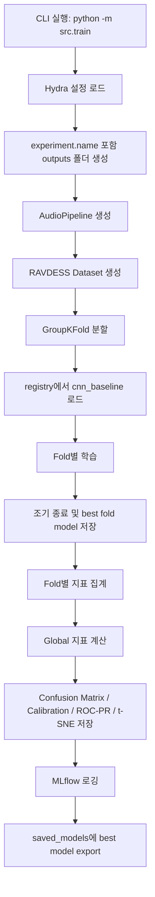
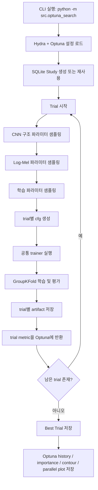
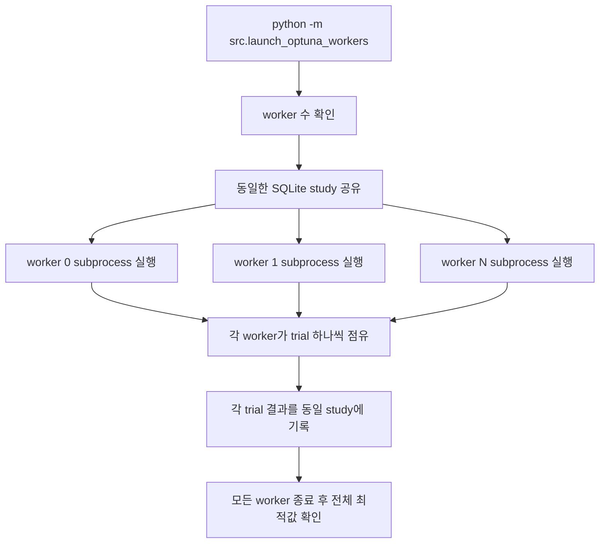

# SER_GraduationPaper 한국어 실행 가이드

## 1. 프로젝트 개요

이 프로젝트는 **RAVDESS 음성 감정 인식(SER)** 데이터셋을 대상으로,  
기본 입력 특징을 **Log-Mel Spectrogram**으로 사용하고,  
기준 모델로 **CNN Baseline**을 학습한 뒤,  
이 CNN Baseline의 구조 및 학습 파라미터와 Log-Mel 생성 파라미터를 함께 **Optuna**로 탐색하여
최적의 baseline 지점을 찾기 위한 코드베이스이다.

현재 구조는 다음 목표를 기준으로 정리되어 있다.

- 기존 `registry pattern` 유지
- 기존 `src/models/base.py`의 `cnn_baseline` 재활용
- `hidden_dims` 길이를 바꿔 CNN stack 수까지 탐색
- Log-Mel 생성 파라미터도 함께 탐색
- Group K-Fold 기반 baseline 평가
- 지표, 시각화, Optuna 결과를 파일로 저장
- `outputs/YYYY-MM-DD/HH-MM-SS_실험명/` 형태로 실험 폴더 저장
- 하드웨어가 허용하는 범위에서 subprocess 기반 병렬 Optuna worker 실행 가능

---

## 2. 현재 코드 구조

핵심 파일은 아래와 같다.

- `src/models/base.py`
  - `cnn_baseline` 모델 정의
- `src/train.py`
  - 일반 학습 엔트리포인트
- `src/engine/trainer.py`
  - 공통 학습/평가/시각화/모델 저장 엔진
- `src/optuna_search.py`
  - Optuna 기반 하이퍼파라미터 탐색 엔트리포인트
- `src/launch_optuna_workers.py`
  - 여러 subprocess worker를 띄워 Optuna 탐색을 병렬 수행
- `src/configs/config.yaml`
  - 기본 공통 설정
- `src/configs/optuna/default.yaml`
  - Optuna 탐색 기본 설정
- `src/utils/viz_optuna.py`
  - Optuna 시각화 저장

---

## 3. CNN Baseline은 기존 파일을 그대로 쓰는가?

그렇다.  
기존 `src/models/base.py`에 정의된 `cnn_baseline`을 그대로 사용한다.

이 모델은 `hidden_dims` 리스트 길이에 따라 convolution block 수가 바뀌므로,  
기존 4-stack 고정 모델처럼 보이지만 실제로는 아래처럼 가변형으로 활용 가능하다.

- `hidden_dims: [64, 128, 256]` -> 3 blocks
- `hidden_dims: [64, 128, 256, 512]` -> 4 blocks
- `hidden_dims: [64, 96, 160, 256, 384]` -> 5 blocks

즉, 모델 파일을 새로 갈아엎지 않고도 **기존 registry 구조를 유지한 채 baseline 탐색**이 가능하다.

---

## 4. 실험 흐름

### 4.1 일반 학습 흐름



### 4.2 Optuna 실험 흐름



### 4.3 병렬 Optuna worker 흐름



---

## 5. 현재 실험에서 사용하는 주요 하이퍼파라미터

현재 Optuna 탐색 대상은 크게 세 부류이다.

### 5.1 CNN 구조 관련

설정 위치: `src/configs/optuna/default.yaml`

- `cnn.min_blocks`
  - CNN block 최소 개수
- `cnn.max_blocks`
  - CNN block 최대 개수
- `cnn.channel_choices`
  - 각 block에서 사용할 channel 후보 목록
- `cnn.dropout_min`
  - dropout 최소값
- `cnn.dropout_max`
  - dropout 최대값

실제 trial에서 샘플링되는 파라미터:

- `cnn_num_blocks`
  - CNN block 수
- `cnn_hidden_dim_1`, `cnn_hidden_dim_2`, ...
  - 각 block의 출력 채널 수
  - 현재는 비감소(monotonic non-decreasing) 형태로 샘플링함
- `cnn_dropout`
  - classifier 앞 dropout 비율

의미:

- block 수가 많아질수록 더 깊은 특징 추출 가능
- hidden dim이 커질수록 모델 용량 증가
- dropout은 과적합 방지 강도를 제어

### 5.2 Log-Mel 특징 생성 관련

설정 위치: `src/configs/optuna/default.yaml`

  - 음성 길이 후보
- `logmel.n_mels_choices`
  - mel filter 개수 후보
- `logmel.n_fft_choices`
  - FFT window 크기 후보
- `logmel.hop_length_choices`
  - 프레임 이동 길이 후보
- `logmel.normalize_choices`
  - 정규화 여부
- `logmel.resize_height_choices`
  - spectrogram 높이 리사이즈 후보
- `logmel.resize_width_choices`
  - spectrogram 너비 리사이즈 후보

trial에서 추가로 샘플링되는 파라미터:

- `logmel_f_min`
  - mel filter bank의 최소 주파수
- `logmel_f_max`
  - mel filter bank의 최대 주파수

의미:

  - 입력 음성 길이를 결정
- `n_mels`
  - 주파수 해상도와 모델 입력 높이에 영향
- `n_fft`
  - 시간-주파수 변환 해상도에 영향
- `hop_length`
  - 시간축 세밀도에 영향
- `normalize`
  - 입력 분포 안정화 여부
- `resize_height`, `resize_width`
  - CNN 입력 텐서 해상도에 직접 영향
- `f_min`, `f_max`
  - 어떤 주파수 구간을 강조할지 결정

### 5.3 학습 관련

설정 위치: `src/configs/config.yaml`, `src/configs/optuna/default.yaml`

- `train.batch_size`
  - batch 크기
- `train.learning_rate`
  - 학습률
- `train.weight_decay`
  - L2 regularization
- `train.epochs`
  - 최대 epoch 수
- `train.early_stopping`
  - 개선이 없는 epoch 허용 횟수
- `train.k_folds`
  - Group K-Fold 분할 수
- `train.objective_metric`
  - best model 선택 기준
- `train.num_workers`
  - DataLoader worker 수
- `train.device`
  - `auto`, `cpu`, `cuda`

Optuna에서 샘플링되는 학습 파라미터:

- `train_learning_rate`
- `train_weight_decay`
- `train_batch_size`

의미:

- `learning_rate`
  - 수렴 속도 및 안정성
- `weight_decay`
  - 과적합 억제
- `batch_size`
  - 메모리 사용량 및 gradient noise 수준에 영향

---

## 6. 현재 기본 설정값

기본 공통 설정은 `src/configs/config.yaml`에 있다.

- `epochs: 30`
  - fold별 최대 30 epoch 학습
- `early_stopping: 10`
  - 10 epoch 연속 개선이 없으면 조기 종료
- `k_folds: 5`
  - Group K-Fold 5분할
- `objective_metric: "f1_macro"`
  - 현재 best fold / Optuna 최적화 기준은 macro F1
- `save_best_to_root: true`
  - 일반 학습 시 `saved_models/`에 최고 모델 export

Optuna 기본 설정은 `src/configs/optuna/default.yaml`에 있다.

- `trials: 20`
  - 한 번의 Optuna 실행에서 기본 20 trial 수행
- `parallel_workers: 1`
  - 기본 worker 수 1개
- `trials_per_worker: 10`
  - worker launcher 사용 시 worker당 수행 trial 수
- `metric: "f1_macro"`
  - Optuna objective 반환 metric
- `pruner.warmup_steps: 5`
  - 초반 5 step은 pruning 완화

주의:

- `launch_optuna_workers.py`를 쓸 때 총 예상 trial 수는 대략
  - `parallel_workers * trials_per_worker`
- 단, 기존 study를 재사용하면 누적된다.

---

## 7. 출력 폴더와 저장 결과

현재 Hydra 출력 폴더는 아래 형식이다.

```bash
outputs/YYYY-MM-DD/HH-MM-SS_실험명
```

예:

```bash
outputs/2026-04-13/20-35-10_cnn_baseline_stageA
outputs/2026-04-13/20-48-02_cnn_baseline_trial_0007
```

일반 학습 또는 Optuna trial에서 저장되는 주요 결과:

- resolved config yaml
- fold learning curve
- global confusion matrix
- calibration curve
- ROC/PR curve
- t-SNE 시각화
- summary metrics json
- fold metrics json
- best model weights

Optuna study 종료 후 추가 저장:

- `optuna_best_trial.json`
- `optuna_history.html/png`
- `optuna_importance.html/png`
- `optuna_contour.html/png`
- `optuna_parallel.html/png`

---

## 8. 일반 학습 실행 방법

### 8.1 기본 CNN baseline 학습

```bash
python -m src.train
```

### 8.2 실험명 지정해서 학습

```bash
python -m src.train experiment.name=cnn_baseline_manual experiment.family=cnn_baseline
```

### 8.3 학습률, epoch 등 override

```bash
python -m src.train experiment.name=cnn_baseline_lr1e3 train.learning_rate=0.001 train.epochs=50
```

### 8.4 hidden_dims를 직접 바꿔 CNN stack 실험

```bash
python -m src.train experiment.name=cnn_5blocks model.hidden_dims=[64,128,256,384,512] model.dropout=0.2
```

---

## 9. Optuna 기반 CNN baseline 실험 실행 방법

### 9.1 단일 프로세스 Optuna 실행

```bash
python -m src.optuna_search experiment.family=cnn_baseline experiment.name=cnn_baseline_optuna
```

### 9.2 trial 개수 지정

```bash
python -m src.optuna_search experiment.family=cnn_baseline experiment.name=cnn_baseline_optuna optuna.trials=50
```

### 9.3 study 이름 지정

```bash
python -m src.optuna_search experiment.family=cnn_baseline experiment.name=cnn_baseline_optuna optuna.study_name=cnn_logmel_stageA
```

### 9.4 objective metric 바꾸기

```bash
python -m src.optuna_search train.objective_metric=accuracy optuna.metric=accuracy
```

권장:

- baseline 선정 목적이면 `f1_macro` 유지
- 클래스 불균형 및 클래스별 성능을 같이 보려면 `f1_macro`, `uar`를 함께 확인

---

## 10. Optuna 병렬 실험 실행 방법

여러 subprocess가 **동일한 SQLite study**를 공유하면서 병렬 탐색한다.

### 10.1 worker 2개, worker당 20 trial

```bash
python -m src.launch_optuna_workers experiment.family=cnn_baseline experiment.name=cnn_baseline_parallel optuna.parallel_workers=2 optuna.trials_per_worker=20
```

### 10.2 worker 4개 예시

```bash
python -m src.launch_optuna_workers experiment.family=cnn_baseline experiment.name=cnn_baseline_parallel optuna.parallel_workers=4 optuna.trials_per_worker=15
```

실행 시 프로젝트 루트에 아래 로그가 생긴다.

- `optuna_worker_0.log`
- `optuna_worker_1.log`
- ...

주의:

- GPU가 1개뿐이면 worker 수를 너무 높이지 않는 것이 좋다.
- worker 수가 많으면 디스크 I/O와 메모리 사용량이 커진다.
- 현재 launcher는 같은 Python 환경으로 subprocess를 실행한다.

---

## 11. 현재 Optuna 탐색 공간 요약

현재 기본 탐색 공간은 다음과 같다.

### CNN

- block 수: `3 ~ 6`
- 채널 후보: `[32, 64, 96, 128, 160, 192, 256, 384, 512]`
- dropout: `0.1 ~ 0.5`

### 학습

- learning rate: `1e-4 ~ 3e-3` (log scale)
- weight decay: `1e-6 ~ 1e-3` (log scale)
- batch size: `[16, 32, 64]`

### Log-Mel

- n_mels: `[64, 80, 96, 128, 160]`
- n_fft: `[512, 1024, 2048]`
- hop_length: `[160, 256, 320, 512]` 중 `hop_length < n_fft`
- normalize: `[true, false]`
- resize_height: `[64, 96, 128, 160]`
- resize_width: `[256, 384, 512, 640]`
- f_min: `[0.0, 20.0, 50.0]`
- f_max: `[4000.0, 6000.0, 7000.0, 8000.0]` 중 Nyquist 이하

추가 제약:

- block 수가 늘어나면 downsampling 때문에 입력 해상도가 너무 작으면 trial prune
- `f_min >= f_max`이면 invalid trial로 prune

---

## 12. 추천 실험 전략

### 12.1 1단계: CNN 구조 위주 baseline 찾기

Log-Mel 설정을 거의 고정하고 CNN 구조 위주로 baseline을 먼저 찾는다.

예:

```bash
python -m src.optuna_search experiment.family=cnn_baseline experiment.name=cnn_stage1 optuna.trials=30
```

### 12.2 2단계: Log-Mel 파라미터 조정

1단계에서 좋은 CNN 구성이 보이면, 그 주변에서 Log-Mel 파라미터를 더 세밀하게 조정한다.

### 12.3 3단계: Joint tuning

상위 후보 CNN + Log-Mel 조합만 좁은 범위로 다시 탐색한다.

이유:

- 처음부터 전체 탐색 공간을 너무 넓게 열면 비용이 크다.
- baseline 선정에서는 단계형 탐색이 해석도 쉽고 재현성도 좋다.

---

## 13. Anaconda 사용 방법

### 13.1 새 가상환경 생성

```bash
conda create -n grad_paper_ser python=3.10
```

### 13.2 가상환경 활성화

```bash
conda activate grad_paper_ser
```

### 13.3 패키지 설치

```bash
pip install -r requirements.txt
```

PyTorch는 환경에 따라 별도 설치가 필요할 수 있다.

예시:

```bash
pip install torch torchvision torchaudio
```

CUDA 버전에 맞춘 설치가 필요하면 PyTorch 공식 설치 명령을 사용하는 것이 좋다.

### 13.4 비활성화

```bash
conda deactivate
```

---

## 14. venv 사용 방법

### 14.1 가상환경 생성

Windows PowerShell:

```bash
python -m venv .venv
```

### 14.2 가상환경 활성화

```bash
.venv\Scripts\Activate.ps1
```

### 14.3 패키지 설치

```bash
python -m pip install --upgrade pip
pip install -r requirements.txt
pip install torch torchvision torchaudio
```

### 14.4 비활성화

```bash
deactivate
```

---

## 15. uv 사용 방법

`uv`를 쓰면 빠르게 가상환경을 만들고 패키지를 설치할 수 있다.

### 15.1 uv 설치

공식 설치가 되어 있지 않다면 먼저 `uv`를 설치한다.

예:

```bash
pip install uv
```

### 15.2 가상환경 생성

```bash
uv venv .venv
```

### 15.3 가상환경 활성화

Windows PowerShell:

```bash
.venv\Scripts\Activate.ps1
```

### 15.4 패키지 설치

```bash
uv pip install -r requirements.txt
uv pip install torch torchvision torchaudio
```

### 15.5 Python 명령 실행

```bash
uv run python -m src.train
uv run python -m src.optuna_search optuna.trials=20
```

주의:

- `uv run`은 현재 프로젝트 환경에서 즉시 실행할 때 편리하다.
- PyTorch는 플랫폼에 따라 `uv pip install` 대신 일반 `pip install`이 더 단순할 수도 있다.

---

## 16. 실행 전 체크리스트

- RAVDESS 데이터셋 경로가 `src/configs/data/default.yaml`의 `dataset_path`와 맞는지 확인
- 현재 Python 환경에 `torch`, `torchaudio`, `torchvision` 설치 여부 확인
- `requirements.txt` 설치 여부 확인
- GPU 사용 시 CUDA 호환 PyTorch인지 확인
- Optuna 병렬 실행 전 디스크 용량과 메모리 확인

---

## 17. 자주 쓰는 명령어 모음

### 기본 학습

```bash
python -m src.train experiment.name=cnn_baseline_manual
```

### Optuna 단일 실행

```bash
python -m src.optuna_search experiment.family=cnn_baseline experiment.name=cnn_baseline_optuna optuna.trials=20
```

### Optuna 병렬 실행

```bash
python -m src.launch_optuna_workers experiment.family=cnn_baseline experiment.name=cnn_baseline_parallel optuna.parallel_workers=2 optuna.trials_per_worker=20
```

### 다른 hidden_dims로 직접 baseline 확인

```bash
python -m src.train experiment.name=cnn_manual_5blocks model.hidden_dims=[64,96,160,256,384] model.dropout=0.25
```

---

## 18. 현재 주의사항

- 이 코드의 Optuna 탐색은 **CNN baseline + Log-Mel 조합 최적화**를 목표로 설계되어 있다.
- 현재 worker 병렬화는 subprocess 기반이며, study는 SQLite 하나를 공유한다.
- 일반 학습은 `saved_models/best_model_cnn_baseline.pt`로 best model을 export한다.
- Optuna trial 실행 시에는 trial마다 root best model을 덮어쓰지 않도록 export를 끈다.
- 실제 실행 전에는 반드시 PyTorch가 설치되어 있어야 한다.

---

## 19. 향후 확장 포인트

- stage별 탐색 공간 분리
- attention 모델에도 같은 Optuna 파이프라인 적용
- GPU별 worker 고정
- Optuna 결과 leaderboard csv 추가
- best trial config를 별도 yaml로 export
- MLflow에서 trial 비교 대시보드 정리
---

## baseline 구축 후 할만한 실험방향

아래 항목은 **CNN baseline + log-mel baseline이 정리된 다음** 진행할 만한 후속 실험이다.

전제 조건:

- RNN / GRU / LSTM 계열은 사용하지 않는다.
- 최소한 backbone 안에 **Transformer 계열이 반드시 포함**되어야 한다.
- 그냥 Transformer만 쓰는 것으로 끝내지 말고, **가변길이 처리 방식** 또는 **pooling / token 설계 / local-global 결합 방식**에서 논문용 차별점을 만들어야 한다.
- zero padding, batch zero padding, waveform crop/truncate를 쓰지 않는 방향을 우선 고려한다.
- 현재 baseline처럼 시간축을 강제로 `resize_width`로 맞추는 방식은 baseline용으로는 가능하지만, 후속 논문 실험에서는 **가변 길이 정보를 보존하는 방향**이 더 타당하다.

가변길이 처리 원칙:

- 가장 단순한 방식은 **sample-wise forward + gradient accumulation**이다.
  - 각 샘플의 time frame 수를 그대로 유지한다.
  - 배치는 tensor stack 대신 list로 받고, loss를 누적한 뒤 optimizer step을 수행한다.
- 그다음 대안은 **exact-length bucketing**이다.
  - 동일하거나 거의 동일한 frame 길이끼리만 batch를 구성한다.
  - zero padding 없이도 일부 mini-batch 병렬화가 가능하다.
- PyTorch `NestedTensor`는 ragged input을 다루는 공식 방향이지만 아직 prototype 성격이 강하므로, 논문 메인 실험보다는 보조 실험 또는 구현 검토용으로 두는 편이 안전하다.

### 실험 1. Variable-Length AST Encoder + Attentive Statistics Pooling

핵심 아이디어:

- log-mel을 고정 width 이미지처럼 강제 resize하지 않고, **가변 길이 spectrogram token sequence**로 바꾼다.
- backbone은 **encoder-only Transformer(AST 스타일)** 로 둔다.
- 마지막 분류 head는 단순 CLS token 대신 **Attentive Statistics Pooling(ASP)** 으로 바꾼다.

논문 포인트:

- baseline 대비 차별점이 명확하다.
  - baseline: CNN + fixed resize
  - 제안: Transformer encoder + variable-length token sequence + attentive statistics pooling
- 감정 단서는 전체 구간에 균등하게 있지 않을 수 있으므로, 평균 pooling보다 attention 기반 pooling이 더 설득력 있다.
- 평균뿐 아니라 분산(std)까지 쓰는 pooling은 utterance-level emotion dynamics를 더 잘 담을 가능성이 있다.

구현 포인트:

- `resize_width`를 없애고 시간축 frame 수를 유지한다.
- spectrogram을 patchify해서 token sequence로 만든다.
- token 수는 발화 길이에 따라 달라진다.
- batching은 padding 없이 list 기반 또는 exact-length bucket 기반으로 처리한다.
- 출력 집계는 `mean` 대신 `weighted mean + weighted std` 계열로 설계한다.

추천 차별화 포인트:

- scalar attention이 아니라 **multi-head attentive statistics pooling**
- frame importance뿐 아니라 **channel-wise/vector-wise attentive pooling**
- 길이 정보(length prior) 또는 energy/confidence를 pooling score에 함께 넣는 방식

### 실험 2. CNN Front-End + Conformer Encoder + Attentive Pooling

핵심 아이디어:

- 완전 pure Transformer만 고집하지 말고, 앞단에 **얕은 CNN stem**을 둬서 local spectral pattern을 먼저 추출한다.
- 그 뒤 backbone은 **Conformer encoder** 로 두어 local dependency와 global dependency를 함께 본다.
- 마지막은 attentive pooling 또는 statistics pooling으로 utterance embedding을 만든다.

논문 포인트:

- “Transformer 기반이면서도 CNN의 local inductive bias를 앞단에 남긴 hybrid 구조”라는 점이 명확하다.
- 감정 인식은 짧은 burst, formant 변화, 에너지 패턴 같은 local cue와 긴 문맥 둘 다 중요하므로, CNN + Conformer 조합의 명분이 강하다.
- baseline CNN보다 문맥 modeling이 강하고, pure Transformer보다 local pattern 추출 명분이 좋다.

구현 포인트:

- CNN stem은 stride를 크게 쓰지 말고, time resolution을 과도하게 잃지 않게 설계한다.
- 그 뒤 time-major token으로 reshape해서 Conformer encoder에 넣는다.
- pooling head는 단순 FC보다 attentive/statistics pooling 쪽이 가변길이 utterance 집계에 더 자연스럽다.

추천 차별화 포인트:

- CNN stem 뒤에 **multi-scale temporal tokenization**
- Conformer block 일부를 **emotion-guided attention** 또는 **local-window + global token mixing**으로 변형
- 마지막 pooling에서 **high-arousal cue에 더 민감한 weighting** 설계

### 실험 3. MelTrans 계열 확장: Multi-Scale Patch Transformer + Cross-Scale Fusion

핵심 아이디어:

- 단일 patch size만 쓰지 말고, **fine patch** 와 **coarse patch** 두 흐름을 동시에 만든다.
- backbone은 Transformer encoder를 유지하되, 중간에 **cross-attention 또는 gated fusion**으로 두 scale을 합친다.
- 최종적으로 variable-length token sequence를 pooling해서 분류한다.

논문 포인트:

- 감정 신호는 짧은 phonetic cue와 긴 prosodic cue가 섞여 있으므로, 단일 scale보다 multi-scale token 설계가 더 자연스럽다.
- “Transformer 기반 + patch scale 다중화 + cross-scale fusion”은 논문에서 구조적 차별점으로 쓰기 좋다.

구현 포인트:

- 같은 spectrogram에 대해 patch stride/size를 두 종류로 만든다.
- 두 토큰 스트림을 별도 encoder 또는 shared encoder에 통과시킨다.
- 중간 fusion은 concat보다 cross-attention이 더 설득력 있다.

추천 차별화 포인트:

- coarse token이 전체 prosody를 보고, fine token이 local emotion burst를 본다는 해석
- scale별 attention map 시각화
- ASP head와 결합하여 multi-scale pooled statistics 비교

### 실험 4. Hierarchical / Windowed Transformer for Long Variable-Length Utterances

핵심 아이디어:

- time 길이가 길어질수록 full attention 비용이 커지므로, **windowed attention + hierarchical token merging** 구조를 쓴다.
- backbone은 Transformer 기반을 유지하되, token 수를 단계적으로 줄여서 long utterance를 다룬다.

논문 포인트:

- padding/cropping 없이 길이가 긴 샘플까지 처리하려면 효율 문제가 바로 생긴다.
- 따라서 단순 정확도뿐 아니라 **가변길이 효율성(memory/latency)** 까지 실험 축으로 삼을 수 있다.

구현 포인트:

- 초기에는 local window attention
- 상위 layer로 갈수록 token merge 또는 segment merge
- 마지막은 global token 또는 attentive pooling으로 utterance representation 생성

추천 차별화 포인트:

- merge 기준을 단순 평균이 아니라 **energy / attention saliency 기반**으로 바꾸기
- 감정적으로 덜 중요한 구간은 더 공격적으로 merge하는 방식

### 우선순위 추천

논문용으로 가장 현실적인 순서는 아래가 좋다.

1. **Variable-Length AST Encoder + ASP**
   - baseline 대비 차별점이 가장 명확하고, 구현 난이도도 상대적으로 통제 가능하다.
2. **CNN Front-End + Conformer Encoder + Attentive Pooling**
   - local-global 결합 명분이 강하고, “Transformer 기반 hybrid”라는 논문 서사가 좋다.
3. **Multi-Scale Patch Transformer**
   - 성능이 잘 나오면 논문 차별점이 가장 예쁘게 보일 가능성이 있다.

### 권장 실험 설계 메모

- baseline과의 공정 비교를 위해 front-end feature는 처음에는 동일한 log-mel에서 시작한다.
- 후속 실험에서는 `resize_width`를 제거하고 시간축 가변 길이를 보존하는 것이 핵심이다.
- 분류 head는 단순 FC만 두기보다, variable-length utterance를 fixed embedding으로 집계하는 pooling 모듈을 실험 축으로 넣는 것이 좋다.
- 단순 accuracy만 보지 말고 `f1_macro`, `uar`, 길이별 성능 편차, 짧은 발화/긴 발화 성능 분리 평가도 같이 본다.

### 참고 문헌 / 출발점

- AST: Yuan Gong et al., *AST: Audio Spectrogram Transformer*  
  https://huggingface.co/docs/transformers/v4.38.2/model_doc/audio-spectrogram-transformer
- Conformer: Anmol Gulati et al., *Conformer: Convolution-augmented Transformer for Speech Recognition*  
  https://arxiv.org/abs/2005.08100
- MelTrans: Hui Li et al., *Mel-Spectrogram Relationship-Learning for Speech Emotion Recognition via Transformers*  
  https://www.mdpi.com/1424-8220/24/17/5506
- Attentive Statistics Pooling: Koji Okabe et al., *Attentive Statistics Pooling for Deep Speaker Embedding*  
  https://www.isca-archive.org/interspeech_2018/okabe18_interspeech.pdf
- PyTorch Nested Tensor tutorial  
  https://docs.pytorch.org/tutorials/unstable/nestedtensor.html

주의:

- 위 NestedTensor 문서는 padding 없는 variable-length 처리의 공식 방향을 보기 위한 참고자료다.
- 하지만 본 프로젝트 후속 실험에서는 **RNN/GRU를 쓰지 않는다**.
- 구현 안정성을 우선하면, 1차 실험은 list-batch + gradient accumulation 또는 exact-length bucketing이 더 현실적이다.
