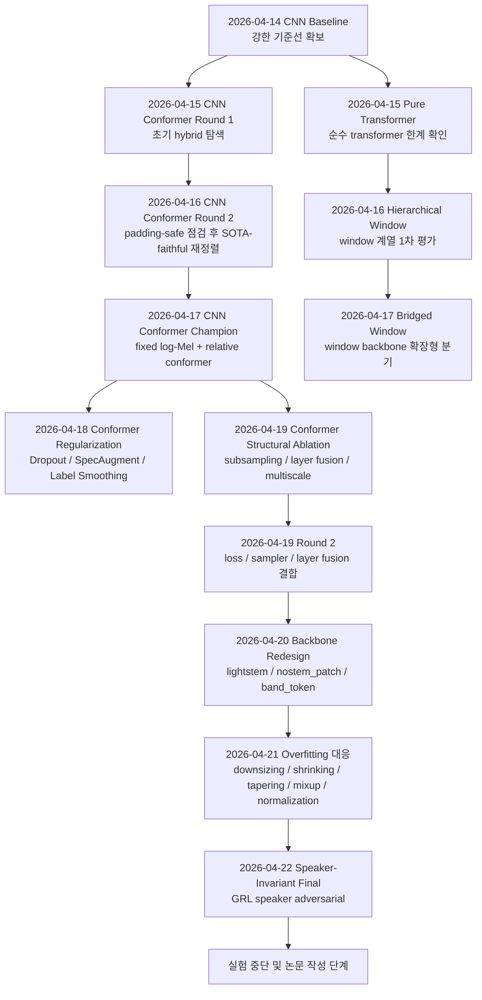
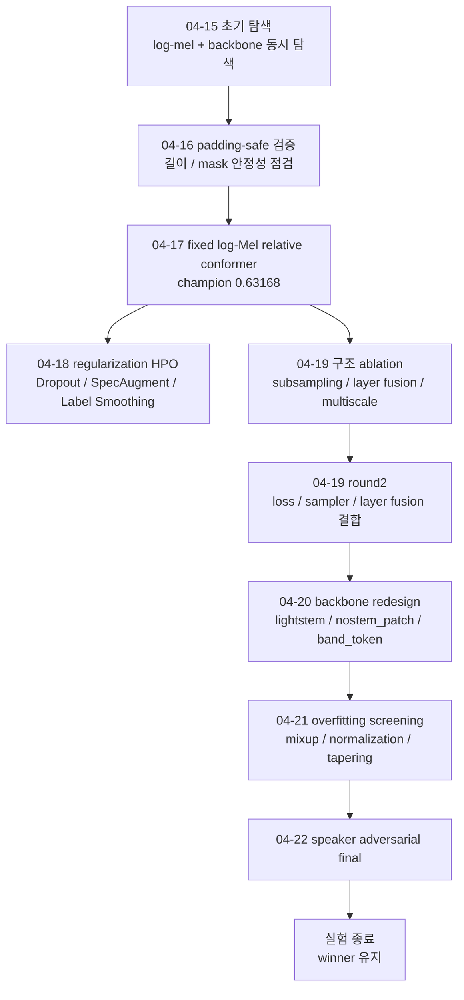

# 실험 전체 흐름도

## 1. 문서 범위

- 목적: 현재까지 수행한 SER 실험의 전체 흐름을 시간순으로 정리하고, 각 단계에서 무엇을 왜 시도했는지 한눈에 파악할 수 있도록 만든 총괄 문서
- 범위:
  - CNN baseline
  - pure transformer
  - hierarchical window transformer
  - bridged window transformer
  - CNN conformer 및 날짜별 세부 라운드
- 원칙:
  - 결과 숫자만 나열하지 않고, 각 단계의 목적, 탐색 축, 실제 후보군, 다음 단계로 넘어간 이유를 같이 적는다.
  - 세부 결과표와 artifact는 각 모델 문서를 참조하고, 이 문서는 흐름 파악 중심으로 유지한다.

## 2. 한눈에 보는 전체 타임라인

## 3. 모델별 큰 흐름

| 순서 | 날짜 | 모델 / 단계 | 목적 | 최고 성능 요약 | 결론 |
|---|---|---|---|---|---|
| 1 | 2026-04-14 | CNN baseline | 비교 기준선 확보 | `F1 0.62196` | transformer 계열 평가 기준으로 고정 |
| 2 | 2026-04-15 | pure transformer | CNN 없는 순수 transformer 가능성 점검 | `F1 0.51163` | 작은 SER 데이터에서는 불리 |
| 3 | 2026-04-16 | hierarchical window transformer | local window 기반 2-stage transformer 검증 | `F1 0.48765` | 현재 구현 상태로는 약함 |
| 4 | 2026-04-17 | bridged window transformer | window backbone에 global bridge context 추가 | `F1 0.55340` | hierarchical보다 설계는 낫지만 CNN/Conformer급은 아님 |
| 5 | 2026-04-15 ~ 2026-04-22 | CNN conformer | hybrid backbone을 주력 후보로 발전 | peak `F1 0.70563` | 최종 transformer 대표 실험축 |

참조 문서:

- CNN baseline: [KR_MODELS_CNN_BASELINE.md](./KR_MODELS_CNN_BASELINE.md)
- pure transformer: [KR_MODEL_PURE_TRANSFORMER.md](./KR_MODEL_PURE_TRANSFORMER.md)
- transformer 개요: [KR_MODELS_TRANSFORMERS.md](./KR_MODELS_TRANSFORMERS.md)
- hierarchical window: [KR_MODEL_HIERARCHICAL_WINDOW_TRANSFORMER.md](./KR_MODEL_HIERARCHICAL_WINDOW_TRANSFORMER.md)
- bridged window: [KR_MODEL_BRIDGED_WINDOW_TRANSFORMER.md](./KR_MODEL_BRIDGED_WINDOW_TRANSFORMER.md)
- CNN conformer 메인: [KR_MODEL_CNN_CONFORMER.md](./KR_MODEL_CNN_CONFORMER.md)

## 4. CNN Baseline 흐름

### 4.1 역할

- 가장 먼저 확보한 강한 기준선이다.
- 이후 모든 transformer 계열 결과는 이 baseline과 비교하는 구조로 해석했다.

### 4.2 실제 탐색 축

- 구조:
  - `hidden_dims`
  - `dropout`
- 학습:
  - `learning_rate`
  - `weight_decay`
  - `batch_size`
- log-Mel:
  - `n_mels`
  - `n_fft`
  - `hop_length`
  - `normalize`
  - `resize_height`, `resize_width`
  - `f_min`, `f_max`

### 4.3 대표 결과

- 최고 trial: `trial_0023`
- 성능: `F1 0.62196 / Acc 0.61667 / UAR 0.61563`
- 대표 설정:
  - `hidden_dims=[32, 64, 256, 512]`
  - `dropout=0.33238`
  - `n_mels=80`
  - `n_fft=1024`
  - `hop_length=160`
  - `resize=96x512`

### 4.4 해석

- 작은 SER 데이터에서는 CNN의 local inductive bias가 여전히 강했다.
- 이 baseline을 넘지 못하는 transformer 구조는 후속 주력 후보에서 제외하거나 보조 비교군으로만 유지했다.

## 5. Pure Transformer 흐름

### 5.1 시도 목적

- CNN stem 없이 spectrogram patch만으로 transformer가 작동하는지 확인하는 순수 기준선 실험

### 5.2 실제 탐색 축

- patch tokenization:
  - `patch_size`
  - `patch_stride`
- encoder:
  - `embed_dim`
  - `num_layers`
  - `num_heads`
  - `ffn_dim`
  - `dropout`
- pooling:
  - `attention`
  - `mean`
  - `cls`
- log-Mel / 학습:
  - `n_mels`, `n_fft`, `hop_length`, `f_min`, `f_max`, `normalize`
  - `batch_size`, `learning_rate`, `weight_decay`

### 5.3 대표 결과

- 최고 trial: `trial_0016`
- 성능: `F1 0.51163 / Acc 0.52000 / UAR 0.51250`
- 대표 설정:
  - `patch_size=32`
  - `patch_stride=8`
  - `embed_dim=256`
  - `num_layers=5`
  - `num_heads=4`
  - `ffn_ratio=4`
  - `pooling=mean`

### 5.4 다음 단계로 넘어간 이유

- baseline 대비 격차가 컸다.
- local time-frequency cue를 직접 학습해야 해서 작은 데이터셋에 불리했다.
- 따라서 pure transformer는 주력 후보가 아니라 “왜 local bias가 필요한가”를 설명하는 비교 기준으로 남겼다.

## 6. Hierarchical Window 흐름

### 6.1 시도 목적

- global attention 대신 local window attention과 stage-wise downsampling으로, 더 하드웨어 친화적인 transformer를 만들려는 시도

### 6.2 실제 탐색 축

- stem:
  - `stem_channels`
- stage:
  - `stage_dims`
  - `stage_depths`
  - `num_heads`
- window:
  - `window_sizes`
- MLP:
  - `ffn_ratio`
- regularization / 학습:
  - `dropout`
  - `batch_size`
  - `learning_rate`
  - `weight_decay`
- pooling:
  - `attention`
  - `mean`

### 6.3 대표 결과

- 최고 trial: `trial_0144`
- 성능: `F1 0.48765 / Acc 0.50333 / UAR 0.51250`
- 상위 trial 공통 패턴:
  - `stem=[48,64]`
  - `stage=[128,192]`
  - `depth=2x3`
  - `window=12`
  - `attention pooling`

### 6.4 다음 단계로 넘어간 이유

- 성능이 `cnn_conformer`보다 훨씬 낮았다.
- window 계열 자체를 완전히 포기하기보다, 현재 구현의 약점인
  - relative position bias 부재
  - true shifted-window mask 부재
  - stage 간 global context 연결 부족
  를 보완하는 방향으로 `bridged_window_transformer`를 새로 설계했다.

## 7. Bridged Window 흐름

### 7.1 시도 목적

- hierarchical window의 약점을 보완해, thesis용으로 더 설계 의도가 분명한 window 계열 확장안을 만드는 것

### 7.2 실제 도입 요소

- `RelativeWindowAttention2D`
- true cyclic shifted-window mask
- rectangular window
- `BridgeContext2D`
- `BridgeProjector`
- cross-scale bridge conditioning

### 7.3 실제 탐색 축

- stage width / depth:
  - `stage_dims=[96,160]`, `[128,192]` 계열
  - `depths=[3,2]`, `[2,2]`
- window:
  - `[[4,8],[5,8]]`
  - `[[4,12],[5,12]]`
  - `[[5,8],[5,8]]`
  - `[[5,12],[5,12]]`
- bridge:
  - `bridge_tokens=2, 4, 6`
- MLP:
  - `ffn_ratio=2, 3`
- pooling:
  - `mean`
  - `attention`
- regularization / 학습:
  - `dropout`
  - `learning_rate`
  - `weight_decay`

### 7.4 대표 결과

- 최고 trial: `trial_0082`
- 성능: 최고 F1 약 `0.55340`
- 최고점 패턴:
  - `stage_dims=[96,160]`
  - `depths=[3,2]`
  - `windows=[[4,8],[5,8]]`
  - `bridge_tokens=2`

### 7.5 해석

- hierarchical window보다 구조적 타당성은 좋아졌다.
- 하지만 여전히 CNN baseline이나 CNN conformer 주력선과 경쟁할 정도의 성능은 아니었다.
- 따라서 window 계열은 보조 축으로 정리하고, 주력은 `cnn_conformer`로 집중했다.

## 8. CNN Conformer 상세 흐름

## 8.1 전체 흐름도

## 8.2 Round 1: 2026-04-15 초기 탐색

참조: [cnn_conformer/2026-04-15.md](./cnn_conformer/2026-04-15.md)

### 목적

- CNN-conformer 조합이 baseline에 근접할 가능성이 있는지 빠르게 탐색

### 실제 시도

- log-Mel과 backbone을 함께 넓게 탐색
- 상위권 패턴:
  - `n_mels=64`
  - `hop=256`
  - `stem=[64,96]`
  - `embed=256`
  - `heads=8`
  - `kernel=15`
  - `attention pooling`
- layer 수는 `2~5`까지 다양하게 나왔으나 backbone 큰 틀은 유사

### 결과

- 최고 `F1 0.57946`

### 해석

- 아직 baseline보다 낮았지만, 상위권 설정이 일정하게 모였다.
- 즉 backbone 방향 자체는 틀리지 않았고, 입력 조건과 conformer 구현을 더 정돈해볼 가치가 있다고 판단했다.

## 8.3 Round 2: 2026-04-16 padding-safe 점검과 재정렬

참조: [cnn_conformer/2026-04-16.md](./cnn_conformer/2026-04-16.md)

### 목적

- 가변 길이 / masking / padding 처리를 안전하게 정리하고, SOTA-faithful한 입력 조건으로 다시 정렬

### 실제 시도

- `padding-safe` stage:
  - 길이 / mask 안전성 반영
  - 그러나 동시에 입력 조건과 search space도 크게 변동
- 주요 상위 설정:
  - `n_mels=96`
  - `hop=512`
  - `embed=128`
  - `layers=2~3`
  - `heads=4~8`
  - `ffn=256~512`
  - `kernel=31`

### 결과

- padding-safe stage 최고 `F1 0.49378`

### 해석

- 이 라운드는 “padding-safe가 나쁘다”기보다, search space 전체가 이전 강한 설정에서 이탈한 것이 더 문제였다.
- 그래서 이후에는 입력을 다시 고정했다.
  - `n_mels=80`
  - `hop_length=160`
  - relative attention
  - fixed log-Mel line

## 8.4 Round 3: 2026-04-17 champion 형성

참조: [cnn_conformer/2026-04-17.md](./cnn_conformer/2026-04-17.md)

### 목적

- fixed log-Mel + relative conformer 조건에서 안정적 champion 확보

### 실제 시도

- 공통 고정:
  - `n_mels=80`
  - `n_fft=512`
  - `hop_length=160`
  - `f_min=0`, `f_max=8000`
  - `normalize=True`
  - `attention_type=relative`
  - `chunk_frames=64`, `hop_frames=16`
- 상위권 backbone:
  - `stem=[64,96]`
  - `embed_dim=256`
  - `num_layers=4`
  - `num_heads=8`
  - `ffn_dim=1024`
  - `kernel=31`
  - `attention pooling`
  - `batch=16`

### 결과

- champion `trial_0073`
- `F1 0.63168 / Acc 0.63000 / UAR 0.62813`

### 해석

- 이 시점부터 CNN-conformer가 실제 경쟁력 있는 주력 transformer 후보가 됐다.
- 이후 라운드는 “새 모델을 찾는 단계”가 아니라 “이 champion을 더 올리는 단계”로 전환됐다.

## 8.5 Round 4: 2026-04-18 regularization HPO

참조: [cnn_conformer/2026-04-18.md](./cnn_conformer/2026-04-18.md)

### 목적

- 구조는 고정하고 regularization만으로 generalization을 더 올릴 수 있는지 검증

### 실제 시도 축

- dropout:
  - `stem_dropout`
  - `projector_dropout`
  - `input_dropout`
  - `encoder_dropout`
  - `classifier_dropout`
- SpecAugment:
  - `time_mask_count`
  - `time_mask_width`
  - `freq_mask_count`
  - `freq_mask_width`
- `label_smoothing`

문서와 config 기록상 상위권 패턴은 대체로 다음과 같았다.

- `label_smoothing=0.1`
- time masking 위주
- `freq_mask_count=0`
- encoder dropout 확대

### 결과

- 최고 `F1 0.62084`

### 해석

- champion 회복 실패
- 결론:
  - `label_smoothing` 단독 재시도 우선순위 하락
  - `SpecAugment` 강화를 계속 밀 이유 약화
  - 구조 축으로 다시 이동

## 8.6 Round 5: 2026-04-19 구조 ablation

참조: [cnn_conformer/2026-04-19.md](./cnn_conformer/2026-04-19.md)

### 목적

- conformer 내부 구조 축이 실제로 의미가 있는지 직접 검증

### 실제 시도 축

- subsampling:
  - `standard_4x`
  - `time_preserve_first`
  - `freq_only`
- layer fusion:
  - `last`
  - `learned_sum`
- conv module:
  - `single`
  - `multiscale`
- pooling:
  - `attention`
  - `mean`
- chunk aggregation:
  - `confidence_weighted_logit`
  - `topk_logit`
  - `mean_logit`
- 보조 축:
  - `label_smoothing=0.0 / 0.05`
  - `freq_mask_count=0 / 1`

### 결과

- 최고 `F1 0.62017`
- 최고 조합:
  - `stem_strides=[[2,1],[2,2]]`
  - `layer_fusion=last`
  - `conv_module=single`
  - `attention pooling`
  - `confidence_weighted_logit`

### 해석

- 의미 있었던 것:
  - `time_preserve_first`
- 의미 약했던 것:
  - `learned_sum`
  - `multiscale conv`
- 이 실험의 가치:
  - “좋아 보이는 구조 아이디어”를 실제 데이터로 걸러냈다.

## 8.7 Round 5-2: 2026-04-19 loss / sampler 결합

참조: [cnn_conformer/2026-04-19_round2.md](./cnn_conformer/2026-04-19_round2.md)

### 목적

- 구조 winner를 고정하고, class confusion을 loss와 sampler로 해결할 수 있는지 확인

### 실제 시도 축

- loss:
  - `cross_entropy`
  - `weighted_cross_entropy`
  - `focal_loss`
- sampler:
  - `random`
  - `weighted`
- class weight mode:
  - `none`
  - `effective_num`
- layer fusion:
  - `last`
  - `learned_sum`

### 결과

- 최고 `F1 0.61282`

### 해석

- `focal_loss`와 일부 `learned_sum` 조합이 부분적으로 상위권에 왔지만 champion 갱신 실패
- 따라서 loss/sampler를 더 넓게 파는 대신 backbone 자체를 다시 열어보기로 전환

## 8.8 Round 6: 2026-04-20 backbone redesign

참조: [cnn_conformer/2026-04-20_backbone_redesign.md](./cnn_conformer/2026-04-20_backbone_redesign.md)

### 목적

- 기존 stem 가정 자체를 다시 열어, local cue를 더 덜 뭉개는 front-end로 재설계

### 실제 시도 축

- backbone variant:
  - `lightstem`
  - `nostem_patch`
  - `band_token`
- subsampling:
  - `time_preserve_first` 중심
- nostem tokenization:
  - `time_patch`
- regularization은 좁은 범위 유지

### 핵심 아이디어

- `lightstem`: CNN stem을 더 가볍게 만들어 과도한 압축 완화
- `nostem_patch`: stem을 제거하고 patch/token 기반으로 더 직접적인 sequence 형성
- `band_token`: 주파수 대역 단위로 tokenization을 다르게 하는 시도

### 결과와 해석

- 이 라운드에서 `nostem_patch`가 새 winner backbone으로 부상
- 이후 실험의 주력선은 기존 stem conformer가 아니라 `nostem_patch` 계열로 이동

## 8.9 Round 7: 2026-04-21 generalization / overfitting screening

참조:

- [cnn_conformer/2026-04-21_nostem_generalization.md](./cnn_conformer/2026-04-21_nostem_generalization.md)
- [cnn_conformer/2026-04-22_overfitting_followup.md](./cnn_conformer/2026-04-22_overfitting_followup.md)

### 목적

- 새 winner `nostem_patch`에서 과적합을 줄이고 일반화 성능을 올리는 것

### 실제 시도 축 1: downsizing / shrinking

- `embed_dim` 축소:
  - 예: `128`, `160`, `192`
- `num_layers` 축소:
  - 예: `3`, `4`
- `ffn_ratio` 축소:
  - 예: `3`, `4`
- `time_patch`:
  - `2`, `3`, `4`
- `sequence_shrinking`:
  - `none`
  - `late_2x`
  - `progressive_2x`

개념 정리:

- `downsizing`: 모델 전체 폭과 깊이를 한 번에 줄이는 것
- `sequence shrinking`: encoder 중간에서 token 길이를 줄이는 것

### 실제 시도 축 2: overfitting follow-up 단일 study

- `tapering`
  - layer-wise `channel/ffn shrinking`
  - 예: flat width를 유지하지 않고 뒤층으로 갈수록 줄이는 방식
- `mixup`
  - spectrogram-level mixup
  - `alpha=0.2`, `0.4` 계열
- `normalization`
  - `nostem_patch.norm_variant`
  - `layernorm`
  - `batchnorm`
  - `instancenorm`

개념 정리:

- `tapering`: 층이 깊어질수록 channel/FFN 폭을 점진 축소
- `mixup`: 입력 두 샘플과 라벨을 섞어 decision boundary를 부드럽게 만드는 방식
- `normalization`: token 분포 안정화로 style/amplitude 편차 영향을 줄이는 방식

### 대표 결과

- overfitting screening winner:
  - `trial_0003`
  - `F1 0.70563 / Acc 0.70000 / UAR 0.70938`
  - `mixup alpha=0.4`
  - `time_patch=4`
  - `layernorm`
  - no shrinking

### 해석

- 현재까지 CNN-conformer 전체 최고 성능은 이 라운드에서 나왔다.
- 중요한 점:
  - `mixup`은 명확히 유효
  - `normalization`은 calibration에 도움
  - `tapering`은 과적합 억제 신호는 있었지만 최고점 갱신 실패
  - downsizing / shrinking은 부분적으로 유효하지만 winner는 아니었음

## 8.10 Round 8: 2026-04-22 speaker-invariant final

참조: [cnn_conformer/2026-04-22_speaker_invariant_final.md](./cnn_conformer/2026-04-22_speaker_invariant_final.md)

### 목적

- mixup winner 위에 speaker shortcut 억제용 adversarial branch를 추가해 unseen actor generalization을 더 올릴 수 있는지 검증

### 실제 시도 축

- `speaker_adversarial.enabled`
  - `false`
  - `true`
- `speaker_adversarial.loss_weight`
  - `0.05`, `0.1`, `0.2`
- `speaker_adversarial.grl_lambda`
  - `0.5`, `1.0`
- `speaker_adversarial.hidden_dim`
  - `64`, `128`
- `speaker_adversarial.dropout`
  - `0.1`, `0.2`
- 유지 축:
  - `mixup.alpha=0.3, 0.4, 0.5`
  - `norm_variant=layernorm, batchnorm`

### 결과

- 본실험 폴더 기준 최고:
  - `trial_0004`
  - `F1 0.70042 / Acc 0.70333 / UAR 0.70000`
  - `speaker_adv=false`
- `speaker_adv=true` 최고:
  - `trial_0003`
  - `F1 0.69110`

### 해석

- speaker adversarial은 이번 범위에서는 winner를 갱신하지 못했다.
- 따라서 최종 결론은:
  - CNN-conformer transformer 라인 최고치는 `mixup winner`
  - speaker adversarial은 검증 가치가 있었지만 최종 채택감은 없음

## 9. 왜 이런 순서로 실험이 이동했는가

### 9.1 실제 이동 규칙

1. baseline을 먼저 고정했다.
2. pure transformer로 “CNN 없는 transformer” 한계를 확인했다.
3. window 계열을 보았지만 성능이 약해 `cnn_conformer`를 주력으로 삼았다.
4. `cnn_conformer`에서는 먼저 champion backbone을 찾았다.
5. 그 다음 regularization만 만져봤지만 성능 회복이 안 돼 구조 ablation으로 이동했다.
6. 구조 ablation과 loss/sampler가 한계에 부딪히자 backbone 재설계를 열었다.
7. backbone redesign으로 `nostem_patch` winner를 얻은 뒤, 과적합 대응 실험으로 집중했다.
8. 마지막으로 speaker shortcut 억제까지 확인했지만 기존 winner를 넘지 못해 중단했다.

### 9.2 반복 실험을 피한 방식

- `label_smoothing` 단독 재시도는 후순위로 내렸다.
- `SpecAugment` 강한 확대도 중단했다.
- `multiscale conv`는 구조 ablation 결과 열세여서 반복하지 않았다.
- `loss/sampler`는 2차 실험에서 plateau를 확인한 뒤 backbone 재설계로 넘어갔다.

## 10. 최종 정리

### 10.1 모델별 현재 위상

| 모델 | 현재 위상 | 이유 |
|---|---|---|
| CNN baseline | 고정 기준선 | 작은 데이터에서 강하고 비교 기준으로 안정적 |
| pure transformer | 비교용 하한선 | local bias 부족으로 약함 |
| hierarchical window | 초기 window 프로토타입 | 구현/구조 한계로 낮은 성능 |
| bridged window | thesis용 확장 실험 | 설계 가치는 있으나 주력선 아님 |
| CNN conformer | 최종 transformer 대표 | 가장 높은 성능과 가장 많은 ablation 확보 |

### 10.2 CNN-Conformer 최종 대표 라인

- backbone: `nostem_patch`
- regularization: `mixup`
- 최고 기록: `F1 0.70563`

### 10.3 논문 작성 관점에서 이 문서의 역할

- “어떤 모델을 했는가”보다 “왜 다음 단계로 넘어갔는가”를 설명하는 흐름도 문서
- Chapter 4 실험 설계/변천 서술의 상위 개요로 바로 사용할 수 있음
- 세부 표와 artifact는 각 모델 문서 및 날짜별 문서로 연결해 보완 가능

## 11. 관련 문서 링크

- [KR_MODELS_CNN_BASELINE.md](./KR_MODELS_CNN_BASELINE.md)
- [KR_MODEL_PURE_TRANSFORMER.md](./KR_MODEL_PURE_TRANSFORMER.md)
- [KR_MODELS_TRANSFORMERS.md](./KR_MODELS_TRANSFORMERS.md)
- [KR_MODEL_HIERARCHICAL_WINDOW_TRANSFORMER.md](./KR_MODEL_HIERARCHICAL_WINDOW_TRANSFORMER.md)
- [KR_MODEL_BRIDGED_WINDOW_TRANSFORMER.md](./KR_MODEL_BRIDGED_WINDOW_TRANSFORMER.md)
- [KR_MODEL_CNN_CONFORMER.md](./KR_MODEL_CNN_CONFORMER.md)
- [cnn_conformer/2026-04-15.md](./cnn_conformer/2026-04-15.md)
- [cnn_conformer/2026-04-16.md](./cnn_conformer/2026-04-16.md)
- [cnn_conformer/2026-04-17.md](./cnn_conformer/2026-04-17.md)
- [cnn_conformer/2026-04-18.md](./cnn_conformer/2026-04-18.md)
- [cnn_conformer/2026-04-19.md](./cnn_conformer/2026-04-19.md)
- [cnn_conformer/2026-04-19_round2.md](./cnn_conformer/2026-04-19_round2.md)
- [cnn_conformer/2026-04-20_backbone_redesign.md](./cnn_conformer/2026-04-20_backbone_redesign.md)
- [cnn_conformer/2026-04-21_nostem_generalization.md](./cnn_conformer/2026-04-21_nostem_generalization.md)
- [cnn_conformer/2026-04-22_overfitting_followup.md](./cnn_conformer/2026-04-22_overfitting_followup.md)
- [cnn_conformer/2026-04-22_speaker_invariant_final.md](./cnn_conformer/2026-04-22_speaker_invariant_final.md)
