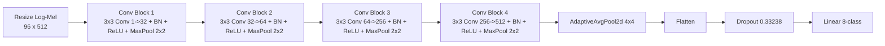

# CNN Baseline

## 1. 문서 범위

- 대상 모델: CNN baseline
- 목적: 기존 기준선 모델의 실험 설정과 결과를 공통 템플릿에 맞춰 보존
- 상태: `reference`

## 2. 모델 스냅샷

### 2.1 한 줄 요약

CNN baseline은 현재 프로젝트의 가장 단순한 기준선이면서도, 작은 SER 데이터셋과 고정 resize 입력 조건에서 강한 성능을 보인 모델이다.

### 2.2 핵심 구성 요소

| 항목 | 값 또는 설명 |
|---|---|
| 입력 표현 | resize된 log-Mel spectrogram |
| 핵심 블록 | CNN stack |
| 주요 구조 파라미터 | `hidden_dims`, `dropout` |
| 출력 pooling | CNN 분류 head 내부 처리 |
| 분류 대상 | 8-class SER |

### 2.3 비교 관점

- transformer 계열 실험의 강한 기준선이다.
- 현재는 추가 Optuna 실험 대상에서 제외되어 있다.

## 3. 실험 라운드 기록

### 3.1 상태 메모

- 기존 기준선 모델
- `outputs/2026-04-14/04-49-31_cnn_optuna_stage1_baselineTest` 기준 최고 `f1_macro = 0.62196`
- 현재는 추가 Optuna 실험 대상에서 제외

### 3.2 이전 Optuna 탐색 파라미터

- 모델 파라미터
  - `hidden_dims`
  - `dropout`
- 학습 파라미터
  - `learning_rate`
  - `weight_decay`
  - `batch_size`
- log-Mel 파라미터
  - `n_mels`
  - `n_fft`
  - `hop_length`
  - `normalize`
  - `resize_height`
  - `resize_width`
  - `f_min`
  - `f_max`

### 3.3 주요 결과 요약

| Rank | Trial | F1-macro | Accuracy | UAR | hidden_dims | dropout | n_mels | n_fft | hop | normalize | resize | f_min | f_max | batch | lr | wd |
|---|---|---:|---:|---:|---|---:|---:|---:|---:|---|---|---:|---:|---:|---:|---:|
| 1 | `trial_0023` | 0.62196 | 0.61667 | 0.61563 | `[32, 64, 256, 512]` | 0.33238 | 80 | 1024 | 160 | true | `96x512` | 0 | 6000 | 16 | 3.41e-4 | 1.93e-5 |
| 2 | `trial_0075` | 0.58003 | 0.60333 | 0.59688 | `[32, 32, 96, 512]` | 0.37040 | 128 | 1024 | 160 | true | `96x512` | 20 | 6000 | 16 | 1.59e-4 | 3.65e-5 |
| 3 | `trial_0060` | 0.57599 | 0.59667 | 0.58125 | `[32, 32, 96, 512]` | 0.32769 | 80 | 1024 | 160 | true | `96x512` | 50 | 6000 | 16 | 2.04e-4 | 5.47e-5 |
| 4 | `trial_0072` | 0.57566 | 0.60667 | 0.58750 | `[32, 32, 96, 512]` | 0.34417 | 80 | 1024 | 160 | true | `96x512` | 20 | 6000 | 16 | 1.55e-4 | 3.01e-5 |
| 5 | `trial_0065` | 0.57488 | 0.59667 | 0.59375 | `[32, 32, 160, 512]` | 0.34306 | 80 | 1024 | 160 | true | `96x512` | 20 | 6000 | 16 | 2.58e-4 | 1.19e-4 |

### 3.4 최종 선택 파라미터

| 항목 | 값 |
|---|---|
| 선택 trial | `trial_0023` |
| hidden_dims | `[32, 64, 256, 512]` |
| dropout | `0.33238` |
| learning_rate | `3.4129546471254387e-4` |
| weight_decay | `1.9338610496754583e-5` |
| batch_size | `16` |
| n_mels | `80` |
| n_fft | `1024` |
| hop_length | `160` |
| normalize | `true` |
| resize_height | `96` |
| resize_width | `512` |
| f_min | `0.0` |
| f_max | `6000.0` |
| accuracy | `0.61667` |
| f1_macro | `0.62196` |
| uar | `0.61563` |

### 3.5 최종 선택 구조

현재 문서에서 기준으로 삼는 CNN baseline 구조는 `trial_0023`의 winner 설정 하나만 의미한다.  
즉, 이후 논문 도식도나 Mermaid는 아래 구조만 반영하면 된다.

## 4. 설계 배경 및 구현 메모

### 4.1 왜 baseline이 강했는가

- 데이터셋이 작아 CNN의 local inductive bias가 유리했다.
- 고정 resize 입력에서 CNN이 time-frequency local pattern을 안정적으로 학습했다.
- pure transformer보다 파라미터 효율과 학습 안정성이 좋았다.

### 4.2 현재 해석

- 상위권 trial은 거의 모두 `batch_size=16`, `n_fft=1024`, `hop_length=160`, `resize=96x512`, `normalize=true`로 모였다.
- 채널 구성은 `32`로 시작하고 마지막 stage를 `512`로 유지하는 구조가 강했다.
- 이후 transformer 계열 실험에서 이 조합은 비교 기준으로 사용할 가치가 있다.

### 4.3 현재 코드 기준 구현 해설

최종 선택 구조는 4개의 동일 패턴 convolution block으로 이루어진다.

1. block 1은 입력 채널 `1`을 `32`로 늘리며 가장 저수준의 시간-주파수 edge와 energy pattern을 추출한다.
2. block 2는 채널을 `64`로 확장하며 초기 국소 패턴을 더 안정적으로 묶는다.
3. block 3과 block 4는 채널을 각각 `256`, `512`까지 넓혀 상위 감정 cue를 압축 표현한다.
4. 각 block 끝의 `MaxPool2d(2x2)`가 해상도를 줄이며 receptive field를 키운다.
5. 마지막의 `AdaptiveAvgPool2d(4x4)`는 feature map 크기를 고정해 분류 head 입력을 안정화한다.
6. 이후 `Flatten -> Dropout -> Linear` 순서로 8개 감정 클래스를 예측한다.

즉 이 모델은 복잡한 attention이나 residual branch 없이, "국소 시공간 패턴 추출 -> 단계적 압축 -> 고정 크기 표현 -> 선형 분류"라는 가장 직선적인 SER baseline 구조다.

## 5. 아티팩트 분석

- 현재 문서에는 baseline 전용 artifact 분석을 따로 누적하지 않았다.
- 필요 시 대표 trial을 기준으로 `../outputs/.../artifacts/`를 후속 추가한다.

## 6. 종합 인사이트 및 다음 액션

- baseline은 더 확장하기보다 고정 비교 기준으로 유지하는 것이 적절하다.
- 이후 모든 transformer 계열 결과는 이 기준선과의 격차 및 장단점을 함께 해석해야 한다.

## 7. 변경 이력

| 날짜 | 변경 내용 |
|---|---|
| 2026-04-19 | 공통 템플릿 기준으로 문서 구조 정리 |
