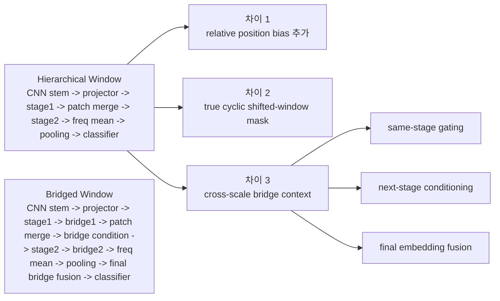

# Bridged Window Transformer

## 1. 문서 범위

- 대상 모델: `bridged_window_transformer`
- 목적: thesis 확장형 window 계열 모델의 설계 배경, 실험 설정, 결과 및 artifact를 누적 관리
- 상태: `active`

## 2. 모델 스냅샷

`bridged_window_transformer`는 기존 `hierarchical_window_transformer`를 그대로 반복 개선한 모델이 아니라, window 기반 SER의 약점을 보완하기 위해 새로 추가한 분기 모델이다.

설계 목표는 세 가지다.

- Speech Swin-Transformer의 강점인 계층형 shifted window 구조를 더 충실하게 반영하기
- DWFormer, LGFA, MSTR 계열이 강조한 local-global 보완 관점을 가져오기
- 완전한 SOTA 복제가 아니라, thesis용 창신점으로 "bridge context"를 넣어 기존 코드베이스에서 실험 가능한 새 축을 만들기

## 3. 설계 배경 및 구현 메모

이 모델은 다음 논문들에서 영감을 받았다.

- Speech Swin-Transformer (Wang et al., ICASSP 2024)
- DWFormer (Chen et al., ICASSP 2023)
- Learning Local to Global Feature Aggregation (Lu et al., Interspeech 2023)
- Multi-Scale Temporal Transformer, MSTR (Li et al., Interspeech 2023)

하지만 구조를 그대로 베낀 것은 아니다. 본 모델의 창신점은 다음 부분이다.

### 타당성 검토

먼저 분명히 해야 할 점이 있다.

- `relative position bias` 자체는 Swin 계열 핵심 요소라서 새 창신점이 아니다.
- `shifted window mask`도 Swin 계열의 정석 구현 요소라서 새 창신점이 아니다.
- `cross-scale bridge context`가 이 모델의 실제 창신점이다.

즉, 이 모델의 새로움은 "window backbone을 더 paper-faithful하게 고치는 것"과 "그 위에 local-global bridge를 추가하는 것"의 조합에 있다.

이 bridge 아이디어는 특정 한 편의 논문에 동일한 이름으로 존재하는 블록을 그대로 옮긴 것은 아니다. 대신 다음 관찰을 종합한 공학적 설계다.

- Speech Swin-Transformer: local window만으로는 patch boundary와 stage 간 전역 문맥 연결이 약할 수 있음
- DWFormer: 지역 중요 구간을 세밀하게 보면서도 cross-window interaction이 필요함
- LGFA: local feature와 global feature의 보완적 결합이 중요함
- MSTR: single-scale local modeling보다 multi-scale/context mixing이 필요함

따라서 `BridgeContext2D`는 "window backbone 위에 매우 작은 전역 bottleneck을 얹어, stage 사이에 전역 정서 요약을 재주입한다"는 thesis용 창신점으로는 타당하다.

다만 엄밀하게 말하면, 이것은 **논문 근거를 바탕으로 한 합리적 추론형 설계**이지, 이미 검증된 정답 구조는 아니다. 올바름은 최종적으로 ablation으로 입증해야 한다.

### Cross-Scale Bridge Context

기존 window 모델은 지역 window 안에서의 attention은 강하지만, utterance 전체 감정 맥락을 stage 내부에 다시 주입하는 경로가 약했다. 이를 보완하기 위해 `BridgeContext2D`와 `BridgeProjector`를 추가했다.

- 각 stage 뒤에서 소수의 learnable bridge token이 전체 spatial feature에 cross-attention
- bridge token이 전역 감정 요약을 형성
- stage 1 bridge summary를 stage 2 입력에 다시 주입
- 마지막 stage bridge summary를 최종 utterance embedding에 더해 local 표현과 global 정서 요약을 결합

핵심 아이디어는 "window backbone은 유지하되, 전역 정서 문맥을 아주 작은 비용으로 stage 사이에 연결한다"는 것이다.

현재 코드에서 이 아이디어는 다음처럼 구현되어 있다.

- `BridgeContext2D`
  - learnable bridge token이 전체 spatial token에 cross-attention
  - bridge token 평균으로 global summary 형성
  - summary를 channel gate로 변환해 같은 stage feature map에 multiplicative reweighting
- `BridgeProjector`
  - stage 1 bridge summary를 stage 2 채널 차원으로 투영
  - patch merging 이후 stage 2 입력에 additive conditioning
- `bridge2_proj`
  - stage 2 bridge summary를 최종 utterance embedding에 additive fusion

즉 현재 구현은 "global token extraction -> same-stage gating -> next-stage conditioning -> final fusion"의 3중 경로를 가진다.

### 기존 window 모델 대비 개선점

### 1. Relative Position Bias

기존 `hierarchical_window_transformer`의 attention은 `nn.MultiheadAttention` 기반이었다. 새 모델은 `RelativeWindowAttention2D`를 따로 구현해 window 내부 상대 위치 bias를 추가했다.

기대 효과:

- window 내부 patch의 상대적 위치 관계를 더 안정적으로 반영
- 단순 content-only attention보다 감정 cue의 위치 패턴을 더 잘 보존

### 2. True Shifted Window Mask

기존 모델의 shifted window는 padding 기반 이동에 가까웠다. 새 모델은 `torch.roll` 기반 cyclic shift와 shift mask를 사용해 Swin 계열 구현에 더 가깝게 바꿨다.

기대 효과:

- window 경계 정보 교환이 더 명확해짐
- 단순 zero-padding shift보다 논문 설계 의도에 가까움

### 3. Rectangular Window

감정 정보는 시간축과 주파수축에서 동일한 스케일로 분포하지 않는다. 따라서 square window만 고정하는 대신 `[freq, time]` 형태의 rectangular window를 stage별로 다르게 둘 수 있게 했다.

예시 후보:

- stage 1: `[4, 8]`, stage 2: `[5, 8]`
- stage 1: `[4, 12]`, stage 2: `[5, 12]`
- stage 1: `[5, 8]`, stage 2: `[5, 8]`

이 부분은 논문 그대로가 아니라, SER 특성에 맞춘 공학적 확장이다.

### 실제 코드 구조

관련 파일:

- `src/models/bridged_window_transformer.py`
- `src/models/bridged_window_blocks.py`
- `src/configs/model/bridged_window_transformer.yaml`
- `src/configs/optuna/bridged_window_cnnfixed.yaml`

### 전체 파이프라인

1. 입력 spectrogram `[B, 1, F, T]`
2. CNN stem 2개로 시간/주파수 downsampling
3. `SpatialProjector`로 stage 1 차원으로 projection
4. stage 1 window transformer block 반복
5. `BridgeContext2D`로 stage 1 전역 bridge token 추출 및 channel gate 적용
6. `PatchMerging2D`로 stage 2 해상도 축소
7. `BridgeProjector`로 stage 1 bridge summary를 stage 2 feature에 주입
8. stage 2 window transformer block 반복
9. 다시 `BridgeContext2D`로 stage 2 전역 bridge token 추출
10. 주파수축 평균 후 시간축 pooling
11. 최종 pooled embedding에 stage 2 bridge summary를 더해 classifier 입력 생성

### 세부 흐름도

```mermaid
flowchart TD
    A[Input log-Mel<br/>B x 1 x F x T] --> B1[ConvStemBlock 1<br/>Conv2d stride 2x2 -> LN -> GELU -> Conv2d -> LN -> GELU]
    B1 --> B2[ConvStemBlock 2<br/>Conv2d stride 2x2 -> LN -> GELU -> Conv2d -> LN -> GELU]
    B2 --> C[SpatialProjector<br/>1x1 Conv -> ChannelLayerNorm2d -> GELU -> Dropout2d]
    C --> D[2D valid mask 생성<br/>lengths_to_2d_valid_mask]
    D --> E[Stage 1 Block Stack]
    E --> E1[Block 1<br/>Window partition -> relative window attention -> MLP]
    E1 --> E2[Block 2<br/>cyclic shift -> shifted window mask -> relative window attention -> reverse shift -> MLP]
    E2 --> F[BridgeContext2D Stage 1]
    F --> F1[feature map flatten -> spatial tokens]
    F1 --> F2[learnable bridge tokens as query]
    F2 --> F3[cross-attention over all stage-1 tokens]
    F3 --> F4[bridge token mean]
    F4 --> F5[channel gate 생성<br/>LayerNorm -> Linear -> Sigmoid]
    F5 --> F6[stage-1 feature reweighting<br/>x = x * 1 + gate]
    F6 --> G[PatchMerging2D]
    G --> G1[2x2 neighbor concat]
    G1 --> G2[LayerNorm]
    G2 --> G3[Linear reduction to stage-2 dim]
    F4 --> H[BridgeProjector]
    H --> H1[LayerNorm -> Linear -> Tanh]
    H1 --> I[Stage-2 input conditioning<br/>x = merged_x + projected_bridge]
    G3 --> I
    I --> J[Stage 2 Block Stack]
    J --> J1[Block 1<br/>Window partition -> relative window attention -> MLP]
    J1 --> J2[Block 2<br/>cyclic shift -> shifted window mask -> relative window attention -> reverse shift -> MLP]
    J2 --> K[BridgeContext2D Stage 2]
    K --> K1[global bridge summary 생성]
    K1 --> L[Frequency mean collapse]
    L --> M[Temporal sequence<br/>B x T' x C]
    M --> N{Pooling}
    N -->|attention| O[AttentivePooling]
    N -->|mean| P[Masked Mean Pooling]
    O --> Q[pooled embedding]
    P --> Q
    K1 --> R[bridge2_proj<br/>LayerNorm -> Linear]
    Q --> S[Final fusion<br/>embedding = pooled + bridge_summary]
    R --> S
    S --> T[Dropout]
    T --> U[Linear classifier -> 8 emotions]
```



### 기존 hierarchical과의 차이 흐름도



### 세부 로직

### Window Attention

`RelativeWindowAttention2D`는 다음 순서로 동작한다.

1. window token에 대해 `qkv` 선형 사상
2. scaled dot-product attention 계산
3. learnable relative position bias 추가
4. shifted-window mask 및 padding token mask 적용
5. softmax 후 value 가중합
6. projection과 dropout 적용

즉, 기존 모델보다 attention 자체가 더 Swin스럽고, speech용 padding mask와 함께 동작한다.

### BridgeContext2D

`BridgeContext2D`는 다음처럼 동작한다.

1. 2D feature map을 `[B, FT, C]` token으로 펼친다.
2. learnable bridge token이 query가 된다.
3. bridge token이 전체 spatial token에 cross-attention 한다.
4. bridge token 평균으로 global summary를 만든다.
5. summary를 sigmoid gate로 바꿔 channel-wise로 feature map에 재주입한다.

이 블록은 기존 window attention이 놓치기 쉬운 utterance-level 정서 요약을 지역 feature map으로 되돌려 보내는 역할을 한다.

중요한 점은, 이 구현이 "유일하게 맞는 bridge 구현"은 아니라는 것이다. 하지만 현재 형태는 최소한 다음 조건은 충족한다.

- 전역 요약을 실제로 계산한다.
- 요약이 같은 stage 내부에 다시 적용된다.
- 요약이 다음 stage에도 전달된다.
- 요약이 최종 classifier 입력에도 반영된다.

즉, 코드상 bridge가 이름만 있고 실제로 안 쓰이는 구조는 아니다.

### Cross-Stage Conditioning

stage 1에서 만든 bridge summary는 `BridgeProjector`를 통해 stage 2 차원으로 변환되고, stage 2 입력 feature에 더해진다.

의도는 단순하다.

- stage 1의 지역 정보 요약을 stage 2에 조건으로 제공
- deeper stage가 "무엇을 더 봐야 하는지" 전역 정서 힌트를 받게 만들기

## 4. 실험 라운드 기록

기본 모델 설정:

- `stem_channels: [48, 64]`
- `stage_dims: [128, 192]`
- `stage_depths: [2, 2]`
- `num_heads: [4, 8]`
- `window_sizes: [[4, 8], [5, 8]]`
- `ffn_ratio: 2.0`
- `bridge_tokens: 4`
- `pooling: attention`
- `dropout: 0.15`

### Optuna 탐색 후보군

`src/configs/optuna/bridged_window_cnnfixed.yaml` 기준

- 고정 log-Mel:
  - `n_mels=80`
  - `n_fft=1024`
  - `hop_length=160`
  - `normalize=true`
  - `f_min=0`
  - `f_max=6000`
- 구조 탐색:
  - `stem_pair`: `[32,48]`, `[48,64]`
  - `stage_spec`: `[96,160] h4x8`, `[128,192] h4x8`, `[128,192] h8x8`
  - `depth_pair`: `2x2`, `2x3`, `3x2`
  - `window_shape`: 4개 후보
  - `bridge_tokens`: `2`, `4`, `6`
  - `ffn_ratio`: `2`, `3`
  - `pooling`: `attention`, `mean`
- 학습 탐색:
  - `batch_size`: `12`, `16`
  - `lr`: `1e-4 ~ 6e-4`
  - `weight_decay`: `1e-5 ~ 5e-4`

### 권장 실험 순서

### 1차 탐색

목적은 "window backbone + bridge context"가 실제로 성능을 끌어올리는지 확인하는 것이다.

권장:

- `optuna=bridged_window_cnnfixed`
- `train.epochs=24`
- `train.folds_to_run=1`
- `optuna.trials=24`

이 단계는 빠른 구조 탐색용이다. `cnn_conformer` best가 이미 존재하므로, 여기서는 full CV보다 "구조가 살아 있는지"를 보는 것이 우선이다.

### 2차 비교 실험

다음 ablation이 가장 중요하다.

1. `hierarchical_window_transformer` vs `bridged_window_transformer`
2. `bridge 제거 버전` vs 기본 버전
3. square window vs rectangular window
4. attention pooling vs mean pooling

권장:

- `train.epochs=30`
- `train.folds_to_run=1`
- 상위 3~5개 조합만 개별 재실행

주의:

- 현재 코드/검색 공간에는 `bridge_tokens=0`이 없다.
- 진짜 bridge ablation을 하려면 추후 `use_bridge=false` 또는 `bridge_tokens=0` 분기를 추가하는 것이 가장 깔끔하다.

### 3차 최종 검증

상위 2~3개 조합만 골라 더 긴 학습과 더 많은 fold로 검증한다.

권장:

- `train.epochs=36`
- `train.folds_to_run=3` 또는 전체 fold
- `optuna` 재탐색보다 고정 조합 재평가에 집중

### 권장 epoch / trial 수

현재 하드웨어와 기존 transformer 계열 실험 관행을 같이 고려하면 다음이 적절하다.

| 단계 | 목적 | epochs | COMPLETE trials | folds_to_run |
|---|---|---:|---:|---:|
| 1차 탐색 | 구조 생존 여부 확인 | 24 | 24 | 1 |
| 2차 미세탐색 | 상위 조합 압축 | 30 | 16 | 1 |
| 최종 검증 | 논문용 비교 | 36 | 0 또는 고정 조합 재실행 | 3 또는 전체 |

실무적으로는 다음처럼 보면 된다.

- 처음부터 `epochs=36`, `trials=30`으로 길게 돌리지 말 것
- 먼저 `24x24`로 구조가 살아있는지 확인
- 살아 있으면 상위권만 다시 `30 epoch` 전후로 좁혀서 검증
- 최종 표와 그래프는 top 2~3 조합만 장기 학습 + 다중 fold로 생성

### 실행 명령 예시

```powershell
python -m src.optuna_search optuna=bridged_window_cnnfixed model=bridged_window_transformer experiment.family=bridged_window_transformer experiment.name=bridged_window_cnnfixed_stage1 train.device=cuda train.epochs=30 train.folds_to_run=1
```

### 권장 1차 탐색 명령

```powershell
python -m src.optuna_search optuna=bridged_window_cnnfixed model=bridged_window_transformer experiment.family=bridged_window_transformer experiment.name=bridged_window_stage1_search24 train.device=cuda train.epochs=24 train.folds_to_run=1 optuna.trials=24
```

### 권장 2차 미세탐색 명령

```powershell
python -m src.optuna_search optuna=bridged_window_cnnfixed model=bridged_window_transformer experiment.family=bridged_window_transformer experiment.name=bridged_window_stage2_refine train.device=cuda train.epochs=30 train.folds_to_run=1 optuna.trials=16
```

### 최종 비교 검증 명령

```powershell
python -m src.train model=bridged_window_transformer experiment.family=bridged_window_transformer experiment.name=bridged_window_final_eval train.device=cuda train.epochs=36 train.folds_to_run=3 data.n_mels=80 data.n_fft=1024 data.hop_length=160 data.normalize=true data.f_min=0.0 data.f_max=6000.0 model.stem_channels=[48,64] model.stage_dims=[128,192] model.stage_depths=[2,2] model.num_heads=[4,8] model.window_sizes=[[4,8],[5,8]] model.bridge_tokens=4 model.ffn_ratio=2.0 model.pooling=attention model.dropout=0.15
```

### 현재 판단

논문 작성 관점에서 이 모델은 단순 SOTA 재현보다 thesis용 가치가 높다.

이유는 다음과 같다.

- window 계열의 약점을 코드 수준에서 명확히 분석하고 반영했다.
- 기존 구현의 한계점을 직접 보완하는 설계라 서사 구성이 좋다.
- 완전한 복제가 아니라, "cross-scale bridge context"라는 분명한 창신점을 가진다.
- 현재 저장소의 Hydra/Optuna 구조에 바로 얹혀 실험 가능하다.

즉, `bridged_window_transformer`는 "window transformer 계열을 완전히 버리기 전에 시도할 만한, 가장 thesis 친화적인 확장안"으로 보는 것이 적절하다.

## 5. 주요 결과 및 아티팩트 기록

기준 산출물:

- 1차 실행: `outputs/2026-04-17/15-14-38_bridged_window_stage1_try`
- 2차 실행: `outputs/2026-04-17/15-23-22_bridged_window_stage1_try`

정리 메모:

- `15-14-38` 실행은 `trial_0000`의 `resolved_config.yaml`만 남아 있고 완료된 `trial_summary.json`은 없다.
- 실제 집계 대상은 `15-23-22` 실행의 완료 trial 28개다.
- 두 실행 모두 고정 입력 조건은 동일하다.
  - `n_mels=80`, `n_fft=1024`, `hop_length=160`, `f_min=0`, `f_max=6000`, `normalize=true`, `resize_enabled=false`

### 완료 trial Top 5

| Rank | Trial | F1-macro | Accuracy | UAR | stem | stage_dims | depths | windows | ffn | bridge | pooling | chunk / hop | aggregation | dropout | lr | wd |
|---|---:|---:|---:|---:|---|---|---|---|---:|---:|---|---|---|---:|---:|---:|
| 1 | `0082` | 0.55338 | 0.56333 | 0.56250 | `[48,64]` | `[96,160]` | `[3,2]` | `[[4,8],[5,8]]` | 3 | 2 | mean | `48 / 12` | mean_logit | 0.101 | 1.17e-4 | 6.04e-5 |
| 2 | `0081` | 0.54379 | 0.56667 | 0.54688 | `[48,64]` | `[96,160]` | `[3,2]` | `[[4,8],[5,8]]` | 3 | 2 | mean | `48 / 12` | mean_logit | 0.100 | 1.17e-4 | 6.21e-5 |
| 3 | `0032` | 0.53195 | 0.55000 | 0.54375 | `[48,64]` | `[128,192]` | `[2,2]` | `[[4,12],[5,12]]` | 3 | 2 | mean | `48 / 12` | confidence_weighted_logit | 0.152 | 1.52e-4 | 2.90e-5 |
| 4 | `0045` | 0.53173 | 0.55333 | 0.53750 | `[48,64]` | `[128,192]` | `[2,2]` | `[[4,12],[5,12]]` | 2 | 2 | mean | `48 / 12` | mean_logit (`topk_ratio=0.75`) | 0.119 | 1.77e-4 | 6.37e-5 |
| 5 | `0063` | 0.53083 | 0.55000 | 0.53438 | `[48,64]` | `[128,192]` | `[2,2]` | `[[4,12],[5,12]]` | 3 | 6 | mean | `48 / 12` | confidence_weighted_logit | 0.111 | 1.25e-4 | 4.39e-5 |

별도 최고값:

- 최고 F1 / 최고 UAR: `trial_0082`
- 최고 Accuracy: `trial_0081` (`acc=0.56667`)

### 상위권 패턴 요약

- Top 10이 전부 `mean pooling`이다.
- Top 10이 전부 `stem=[48,64]`, `num_heads=[4,8]`, `batch_size=16`, `chunk_frames=48`, `hop_frames=12`에 모였다.
- 최고점은 `stage_dims=[96,160]`, `depths=[3,2]`, `windows=[[4,8],[5,8]]`에서 나왔다.
- 반대로 평균 성능은 `stage_dims=[128,192]`, `depths=[2,2]`, `windows=[[4,12],[5,12]]` 쪽이 더 안정적이었다.

완료 trial 28개 전체 평균 비교:

- pooling
  - `mean`: mean F1 0.4777, max F1 0.5534
  - `attention`: mean F1 0.2970, max F1 0.4624
- window
  - `4x12|5x12`: mean F1 0.5021, max F1 0.5319
  - `4x8|5x8`: mean F1 0.4616, max F1 0.5534
  - `5x12|5x12`: mean F1 0.3729
  - `5x8|5x8`: mean F1 0.1784
- bridge token
  - `bridge=2`: max F1 0.5534
  - `bridge=6`: mean F1은 `bridge=2`와 비슷하지만 최고점은 더 낮다
  - `bridge=4`: mean F1 0.2438로 뚜렷하게 부진하다

즉 이번 stage 1 search에서는 다음 해석이 가장 자연스럽다.

- `attention pooling`은 bridged-window 구조와 잘 맞지 않았다.
- `bridge token`을 많이 늘리는 것보다 `2`개 정도의 작은 bridge가 더 안전했다.
- 좁은 window (`4x8|5x8`) + stage1을 한 층 더 깊게 가져간 조합이 최고점은 만들었다.
- 하지만 평균적으로는 약간 넓은 time window (`4x12|5x12`)와 얕은 `2/2` 구성이 더 안정적이었다.

### Best Trial Artifact 분석

#### Trial 0082

- trial 요약: [trial_summary.json](../outputs/2026-04-17/15-23-22_bridged_window_stage1_try/optuna_trials/trial_0082/trial_summary.json)
- metrics: [summary_metrics.json](../outputs/2026-04-17/15-23-22_bridged_window_stage1_try/optuna_trials/trial_0082/artifacts/summary_metrics.json)
- learning curve: [fold_1_learning_curve.png](../outputs/2026-04-17/15-23-22_bridged_window_stage1_try/optuna_trials/trial_0082/artifacts/fold_1_learning_curve.png)
- confusion matrix: [global_confusion_matrix.png](../outputs/2026-04-17/15-23-22_bridged_window_stage1_try/optuna_trials/trial_0082/artifacts/global_confusion_matrix.png)
- calibration: [global_calibration_curve.png](../outputs/2026-04-17/15-23-22_bridged_window_stage1_try/optuna_trials/trial_0082/artifacts/global_calibration_curve.png)
- t-SNE: [global_tsne_plot.png](../outputs/2026-04-17/15-23-22_bridged_window_stage1_try/optuna_trials/trial_0082/artifacts/global_tsne_plot.png)

#### Artifact 해석

1. Learning curve

- `trial_0082`는 초반 10 epoch 내에 validation loss가 빠르게 내려간 뒤, 대략 epoch 20 전후에서 가장 안정적이다.
- 이후 train loss는 계속 감소하지만 validation loss는 `1.39~1.47` 근처에서 진동한다.
- train accuracy는 마지막에 약 `0.65`까지 올라가지만 val accuracy는 `0.48~0.53` 구간에서 정체된다.
- 즉 구조가 완전히 붕괴된 것은 아니지만, best trial도 이미 중간 수준의 과적합 신호를 보인다.

2. Confusion matrix

- 강한 클래스는 `calm=0.82`, `disgust=0.75`, `angry=0.68`이다.
- `neutral`은 `0.55` recall로 유지되지만 `calm`으로 `0.35`가 새고 있다.
- `sad`는 recall이 `0.38`에 머물고 `calm(0.28)`, `disgust(0.15)`로 많이 섞인다.
- 가장 어려운 클래스는 `fearful`로, recall이 `0.23`이고 `happy(0.30)`, `sad(0.12)`, `angry(0.12)` 쪽으로 넓게 퍼진다.
- 따라서 이번 best trial의 병목은 고각성 클래스가 아니라 `sad / fearful / surprised`의 경계 분리다.

3. Calibration

- `trial_0082`의 ECE는 `0.0566`으로 비교적 양호하다.
- 중간 confidence 구간은 대체로 대각선 근처를 따라간다.
- 다만 `0.8` 이상 고신뢰 구간에서 약간의 over-confidence가 남아 있다.
- 즉 최고 F1 trial이면서 calibration도 크게 망가지지 않은 편이다.

4. t-SNE

- `neutral-calm`과 `disgust`는 어느 정도 cluster 성향이 보인다.
- 그러나 `happy-sad-fearful`은 넓게 겹쳐 있고 class margin이 충분히 크지 않다.
- 결국 confusion matrix에서 보인 `sad/fearful` 혼동이 embedding space에서도 그대로 드러난다.

### 경쟁 trial 비교

#### Trial 0081

- trial 요약: [trial_summary.json](../outputs/2026-04-17/15-23-22_bridged_window_stage1_try/optuna_trials/trial_0081/trial_summary.json)
- 최고 accuracy trial이지만 macro 계열 metric은 `0082`보다 낮다.
- confusion matrix를 보면 `neutral` recall이 `0.25`까지 떨어지고 `neutral -> calm` 오분류가 `0.40`으로 더 심하다.
- 대신 전체 accuracy와 ECE(`0.0470`)는 약간 더 좋다.
- 해석하면 `0081`은 다수/쉬운 클래스 쪽으로 더 보수적으로 맞추고, `0082`는 class balance를 조금 더 회복해 macro-F1과 UAR을 끌어올린 케이스다.

#### Trial 0032

- trial 요약: [trial_summary.json](../outputs/2026-04-17/15-23-22_bridged_window_stage1_try/optuna_trials/trial_0032/trial_summary.json)
- `stage_dims=[128,192]`, `windows=[[4,12],[5,12]]`인 더 큰 안정형 조합이다.
- confusion matrix에서는 `angry(0.78)`, `fearful(0.55)`, `disgust(0.68)`, `surprised(0.57)`가 상대적으로 잘 나온다.
- 반면 `happy` recall이 `0.15`까지 낮아지고 `neutral`도 `0.45` 수준이라 macro-F1이 더 이상 올라가지 못한다.
- 즉 큰 stage width와 긴 time window는 일부 고각성/명확 클래스에는 유리하지만, `happy-neutral-sad`의 미세 경계를 더 잘 푸는 방향은 아니었다.

## 6. 종합 인사이트 및 다음 액션

- 이번 탐색에서 bridged window는 `mean pooling`이 사실상 정답에 가까웠다. `attention pooling`은 평균도 최고점도 모두 밀렸다.
- 최고 성능은 "더 작은 hidden width + 더 깊은 stage1 + 더 짧은 time window" 조합에서 나왔다.
- 그러나 평균 성능은 "더 넓은 stage width + 2/2 depth + 4x12/5x12 window" 쪽이 더 안정적이었다. 즉 현재 구조는 peak-search와 robust-search의 최적점이 다르다.
- `bridge_tokens=4`가 일관되게 약한 것은 bridge 자체보다 bridge 용량 조절이 더 중요하다는 신호로 볼 수 있다.
- artifact 기준 병목은 `neutral-calm`, `sad-fearful`, `happy-fearful` 분리다. 다음 실험은 backbone 확대보다 이 경계들을 직접 겨냥하는 쪽이 효율적이다.

### 다음 액션

1. 최고점 재검증

- `trial_0082` 조합으로 `folds_to_run=3` 이상 재평가
- 현재 결과는 fold 1 기준이라 분산 확인이 필요하다

2. 안정형 조합 미세조정

- `stage_dims=[128,192]`, `depths=[2,2]`, `windows=[[4,12],[5,12]]`를 유지
- `bridge_tokens=2`, `ffn_ratio=3`, `mean pooling` 고정
- `dropout`과 `weight_decay`만 다시 좁게 탐색

3. confusion-targeted 개선

- `sad/fearful` 분리를 강화하는 보조 loss 또는 class-balanced sampling 검토
- `neutral/calm` 분리를 위해 chunk aggregation을 `confidence_weighted_logit` 중심으로 재탐색
- 필요하면 `bridge_tokens=2` 고정 후 stage 2만 조금 넓히는 ablation 추가

## 7. 변경 이력

| 날짜 | 변경 내용 |
|---|---|
| 2026-04-19 | 공통 템플릿 기준으로 상위 섹션 구조 정리 및 상대경로 통일 |
