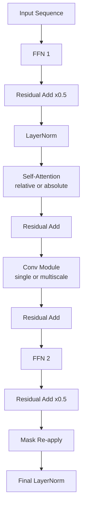

# CNN Conformer

## 1. 문서 범위

- 대상 모델: `cnn_conformer`
- 목적: CNN Conformer 계열의 구조 이해, 코드 기준 구현 해설, 날짜별 실험 문서 인덱스, 차후 실험 방향 정리
- 상태: `active`

이 문서는 더 이상 날짜별 실험 로그를 모두 누적하는 저장소가 아니다.  
실험 회차별 상세 결과는 하위 문서로 분리하고, 이 문서는 `cnn_conformer` 구조를 빠르게 이해하고 각 회차 문서로 이동하기 위한 기준 문서로 유지한다.

## 2. 모델 스냅샷

### 2.1 한 줄 요약

`cnn_conformer`는 Log-Mel spectrogram에서 CNN stem으로 국소 시간-주파수 패턴을 먼저 압축하고, 이후 Conformer encoder로 장단기 문맥을 함께 읽어 감정을 분류하는 SER 모델이다.

### 2.2 핵심 구성 요소

| 항목 | 값 또는 설명 |
|---|---|
| 입력 표현 | `log-Mel spectrogram`, 기본 실험 축은 주로 `n_mels=80`, `hop_length=160` |
| 입력 stem | 2-stage `ConvStemBlock` |
| 시퀀스 투영 | `FlattenFrequencyProjector` |
| 핵심 블록 | `CNNConformerBlock` = `FFN -> MHSA -> Conv -> FFN` |
| attention | 기본 `relative positional MHSA` |
| 계층 융합 | `last` 또는 `learned_sum` |
| utterance pooling | `attention` 또는 `mean` |
| 출력 | 8-class emotion classifier |

### 2.3 프로젝트 내 비교 관점

- CNN baseline보다 local cue와 global context를 더 함께 다룰 수 있는 주력 후보 구조다.
- window transformer 계열보다 현재 저장소에서는 더 안정적으로 상위권 정확도를 형성했다.
- 다만 최근 구조 확장 실험에서 peak accuracy가 다시 내려간 사례가 있어, 무작정 구조를 늘리기보다 어떤 축이 실제로 유효한지 통제된 실험이 중요하다.

## 3. 아키텍처 상세

### 3.1 전체 흐름

1. 입력은 `[B, 1, F, T]` 형태의 spectrogram이다.
2. `ConvStemBlock` 두 개가 시간축과 주파수축을 줄이면서 국소 패턴을 추출한다.
3. stem 출력의 주파수 축을 평균 내지 않고 그대로 펼쳐 `FlattenFrequencyProjector`가 `embed_dim`으로 투영한다.
4. 투영된 시퀀스를 `CNNConformerBlock` 여러 층에 통과시킨다.
5. 계층 융합 전략에 따라 마지막 층만 쓰거나 `learned_sum`으로 합친다.
6. sequence norm 후 `attention pooling` 또는 `mean pooling`으로 utterance embedding을 만든다.
7. 분류기에서 8개 감정 클래스로 예측한다.

### 3.2 전체 파이프라인 Mermaid

```mermaid
flowchart LR
    A[Log-Mel Spectrogram\nB x 1 x F x T] --> B[ConvStemBlock 1\nConv2d + Norm + GELU]
    B --> C[ConvStemBlock 2\nConv2d + Norm + GELU]
    C --> D[FlattenFrequencyProjector\nflatten freq bins\nLayerNorm + Linear]
    D --> E[Positional Dropout]
    E --> F[CNNConformerBlock x N]
    F --> G{Layer Fusion}
    G -->|last| H[Last Layer Output]
    G -->|learned_sum| I[Weighted Sum of Layers]
    H --> J[LayerNorm]
    I --> J
    J --> K{Pooling}
    K -->|attention| L[AttentivePooling]
    K -->|mean| M[Masked Mean Pooling]
    L --> N[Classifier]
    M --> N
    N --> O[8 Emotion Logits]
```



### 3.3 Conformer block 상세

현재 구현의 `CNNConformerBlock`은 macaron-style FFN과 convolution module을 유지하면서, attention만 `relative`와 `absolute`를 바꿔 ablation할 수 있게 분리되어 있다.



### 3.4 Stem stride 해석

이 코드베이스에서 `stem_strides`는 `(freq, time)` 순서다.  
따라서 time subsampling 완화는 `[[2,1],[2,2]]` 같은 형태로 표현되고, `[[2,1],[2,1]]`는 시간축을 거의 보존하는 설정이다.

```mermaid
flowchart LR
    A[n_mels x time] --> B1[standard_4x\n[[2,2],[2,2]]]
    A --> B2[time_preserve_first\n[[2,1],[2,2]]]
    A --> B3[freq_only\n[[2,1],[2,1]]]
    B1 --> C1[freq 1/4,\ntime 1/4]
    B2 --> C2[freq 1/4,\ntime 1/2]
    B3 --> C3[freq 1/4,\ntime 유지]
```

### 3.5 핵심 파라미터와 역할

| 파라미터 | 역할 | 실험상 의미 |
|---|---|---|
| `stem_channels` | CNN stem 폭 | 초기 local feature 추출량 |
| `stem_strides` | subsampling 강도 | 시간/주파수 해상도 보존 정도 |
| `embed_dim` | encoder 너비 | 표현력과 연산량의 핵심 축 |
| `num_layers` | encoder 깊이 | 문맥 누적량과 smoothing 강도 |
| `num_heads` | attention head 수 | 시간 의존성 분해 granularity |
| `conv_kernel_size` | depthwise conv 시야 | 감정의 짧은 burst vs 긴 prosody 포착 범위 |
| `layer_fusion` | 계층 결합 방식 | 저층 acoustic cue와 고층 context 결합 여부 |
| `conv_module_type` | single / multiscale | local receptive field 다양화 여부 |
| `pooling` | `attention` / `mean` | utterance-level 요약 방식 |
| `aggregation_mode` | chunk-level vote 방식 | 긴 발화 chunk 통합 안정성 |

### 3.6 코드 기준 구현 위치

- 모델 본체: [src/models/cnn_conformer.py](../src/models/cnn_conformer.py)
- 블록 구현: [src/models/cnn_conformer_blocks.py](../src/models/cnn_conformer_blocks.py)
- 공통 transformer 유틸: [src/models/transformer_blocks.py](../src/models/transformer_blocks.py)
- 모델 설정: [src/configs/model/cnn_conformer.yaml](../src/configs/model/cnn_conformer.yaml)
- Optuna 기본 설정: [src/configs/optuna/default.yaml](../src/configs/optuna/default.yaml)
- 구조 탐색 preset: [src/configs/optuna/cnn_conformer_structural.yaml](../src/configs/optuna/cnn_conformer_structural.yaml)

## 4. 논문 근거와 현재 구현의 대응

### 4.1 핵심 참고 논문

- Gulati et al. 2020, Conformer: local convolution과 global self-attention을 결합한 원형 구조
- Zou et al. 2022, co-attention 기반 multi-level acoustic information 융합
- Peng et al. 2021, multi-scale CNN과 attention의 SER 적용
- Pepino et al. 2021, wav2vec 2.0 embedding 기반 SER
- Morais et al. 2022, self-supervised speech feature의 SER 활용

관련 참고문헌:

- [ref.bib](../LateX_Paper/undergraduate-thesis/undergraduate-thesis/misc/ref.bib)

### 4.2 논문과 현재 코드의 정합성

- Conformer의 block ordering은 원형과 같은 큰 골격을 유지한다.
- 입력 front-end는 ASR용 raw feature stack이 아니라 SER용 2-stage CNN stem으로 재구성했다.
- 주파수 축을 평균 풀링하지 않고 flatten 후 projector에 넣는 방식으로, formant와 대역별 에너지 구조를 초기 단계에서 덜 잃도록 했다.
- attention은 Transformer-XL식 상대 위치 인코딩이 아니라 learnable relative bias embedding 기반 구현이다.
- convolution module은 현재 공용 `ConvModule`을 사용하고, 필요 시 multiscale branch를 붙이는 방식으로 변형 가능하게 만들었다.

### 4.3 실험 데이터와 맞물린 해석

- 2026-04-17 champion은 `kernel=31`, `attention pooling`, `embed_dim=256`, `layers=4`로 수렴했다.
- 2026-04-19 구조 탐색에서는 time-preserving subsampling이 peak를 만들었지만, `learned_sum`과 `multiscale conv`는 평균 안정성 또는 가설 검증 수준에 그쳤고 champion을 넘지 못했다.
- confusion matrix 기준 병목은 `sad`, `neutral`, `calm`, `happy`, `fearful`의 경계다. 반면 `angry`는 상대적으로 분리된다.
- 따라서 다음 실험은 “모델을 더 크게”보다 “경계가 겹치는 감정 구간을 더 잘 분리하도록” 가는 편이 타당하다.

## 5. 날짜별 실험 문서

| 날짜 | 문서 | 핵심 내용 |
|---|---|---|
| 2026-04-15 | [2026-04-15.md](./cnn_conformer/2026-04-15.md) | 초기 stage2 Optuna, baseline 수준의 첫 conformer 탐색 |
| 2026-04-16 | [2026-04-16.md](./cnn_conformer/2026-04-16.md) | padding-safe 회귀와 SOTA-faithful 재출발 |
| 2026-04-17 | [2026-04-17.md](./cnn_conformer/2026-04-17.md) | fixed log-Mel relative Conformer champion과 artifact 분석 |
| 2026-04-18 | [2026-04-18.md](./cnn_conformer/2026-04-18.md) | regularization HPO 실패와 underfitting 신호 |
| 2026-04-19 | [2026-04-19.md](./cnn_conformer/2026-04-19.md) | 구조 축 탐색과 subsampling/layer fusion/conv branch 검증 |
| 2026-04-19 Round 2 | [2026-04-19_round2.md](./cnn_conformer/2026-04-19_round2.md) | layer fusion + loss + sampler 결합 탐색 계획서 |

## 6. 다음 실험 권장 방향

### 6.1 결론부터

다음 라운드는 “구조를 더 복잡하게 추가”보다 아래 3축이 적합하다.

1. champion 회복형 미세탐색
2. 선택적 late fusion
3. loss / sampler 결합 탐색

### 6.2 권장안 1: champion 회복형 미세탐색

고정 권장 축:

- `stem_strides=[[2,1],[2,2]]`
- `layer_fusion=last`
- `conv_module_type=single`
- `pooling=attention`
- `aggregation_mode=confidence_weighted_logit`
- `label_smoothing=0.0`
- `freq_mask_count=0`

근거:

- 2026-04-19 최고점 `trial_0043`은 구조 확장보다 위 조합에서 나왔다.
- 2026-04-18 regularization HPO는 강한 규제가 오히려 peak를 깎았다.
- 즉 현재 병목은 “더 많은 장치 추가”가 아니라 “승자 구조를 덜 흐리게 조율하는 것”에 가깝다.

### 6.3 권장안 2: 전층 융합 대신 선택적 late fusion

추천 형태:

- `last2_concat_gate`
- `last2_weighted_sum`
- `layer3_4_fusion`

근거:

- Zou et al. 2022는 multi-level acoustic information의 유효성을 보여준다.
- 하지만 현재 저장소 실험에서는 전층 `learned_sum`이 평균은 올려도 최고점을 깎았다.
- 이 결과는 “multi-level 자체가 틀렸다”보다 “저층부터 전부 섞는 현재 방식이 과도하다”는 해석이 더 맞다.

### 6.4 권장안 3: loss / sampler 결합 탐색

추천 형태:

- `loss`: `cross_entropy`, `weighted_cross_entropy`, `focal_loss`
- `sampler`: `random`, `weighted`
- `layer_fusion`: `last`, `learned_sum`, `last2_mean`

근거:

- 현재 artifact에서 가장 일관된 오류는 `sad`, `neutral`, `calm`, `happy`, `fearful` 경계의 겹침이다.
- 구조 자체보다 학습 신호를 이 구간에 더 강하게 주는 편이 다음 검증 축으로 적합하다.
- 이 실험은 [2026-04-19_round2.md](./cnn_conformer/2026-04-19_round2.md)에 계획서 형태로 분리해 두었다.

## 7. 변경 이력

| 날짜 | 변경 내용 |
|---|---|
| 2026-04-19 | 메인 문서를 구조 설명 중심 기준 문서로 재구성하고, 날짜별 하위 문서 분리 구조를 도입 |
