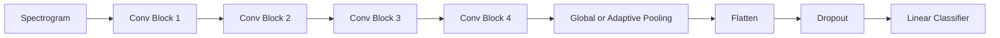
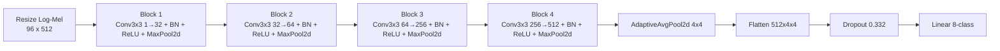
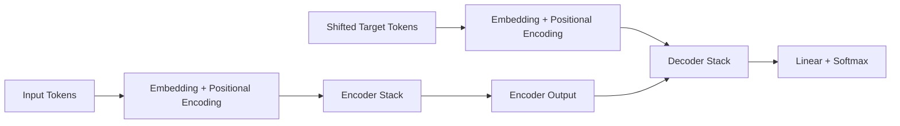
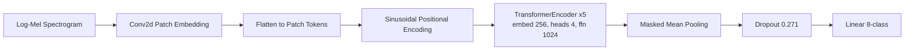
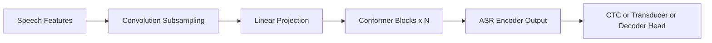
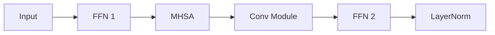
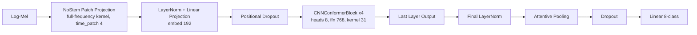
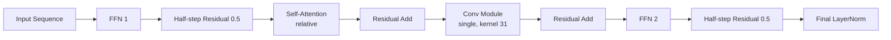
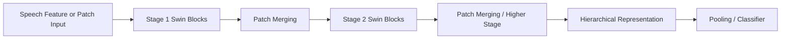

# 모델 원본 논문 구조와 현재 코드 구현 정합성 정리

## 1. 문서 목적

이 문서는 논문용 모델 다이어그램을 직접 그릴 때, 다음 혼동을 막기 위해 만든다.

- 원본 논문 도식을 거의 그대로 따라 그렸는데, 실제 우리 코드 구조와 달라지는 문제
- 현재 코드의 실험 모델이 사실은 “원 논문 재현”이 아니라 “논문 아이디어를 가져온 변형”인데, 원형 모델처럼 서술하는 문제
- `cnn_conformer`, `bridged_window_transformer`처럼 구조 변형이 큰 모델에서, 무엇이 원본이고 무엇이 우리 구현의 변경점인지 섞여 보이는 문제

핵심 원칙은 간단하다.

1. 논문 도식은 “원형 구조”를 이해하기 위한 기준으로만 본다.
2. thesis에 들어갈 최종 다이어그램은 “현재 코드와 실험 모델” 기준으로 그린다.
3. 단, 본문에서는 원형 대비 변경점을 함께 밝혀야 한다.

## 2. 먼저 결론

### 2.1 원형을 거의 그대로 따라 그리면 안 되는 모델

- `cnn_baseline`
  - 단일 원논문 재현 모델이 아니다.
  - 현재 저장소에서 정의한 VGG형 4-block CNN baseline이다.
- `bridged_window_transformer`
  - 단일 원논문 재현 모델이 아니다.
  - `Speech Swin-Transformer`와 `DWFormer`의 아이디어를 참고했지만, 실제 코드는 thesis용 bridge context를 추가한 변형이다.
- `cnn_conformer`
  - `Conformer`의 block ordering은 유지하지만, front-end와 task head는 원논문과 다르다.
  - 따라서 원논문 Figure를 그대로 따라 그리면 안 된다.

### 2.2 상대적으로 원형과 대응이 쉬운 모델

- `pure_transformer`
  - 큰 뼈대는 `Attention Is All You Need`의 encoder 기반 해석과 가장 가깝다.
  - 하지만 현재 코드는 번역용 encoder-decoder가 아니라, SER용 encoder-only classifier다.

## 3. 다이어그램 작성 규칙

논문용 그림을 직접 그릴 때는 아래 규칙으로 가는 것이 안전하다.

- `cnn_baseline`
  - “원본 논문 구조”가 아니라 “현재 프로젝트 baseline 구조”로 그린다.
- `pure_transformer`
  - 원형 설명에서는 encoder-decoder를 적어도, 최종 실험 모델 그림은 반드시 encoder-only classifier로 그린다.
- `cnn_conformer`
  - 원형 설명에서는 convolution subsampling + Conformer blocks + ASR head를 보여줄 수 있다.
  - 최종 실험 모델 그림은 반드시 현재 코드의 front-end variant와 pooling classifier 기준으로 그린다.
- `bridged_window_transformer`
  - 원형 설명에서는 `Speech Swin-Transformer`의 hierarchical shifted-window backbone을 기준으로 이해한다.
  - 최종 실험 모델 그림은 반드시 `BridgeContext2D`, `BridgeProjector`, final bridge fusion까지 포함해 그린다.

## 4. 모델별 정합성

---

## 4.1 CNN baseline

### 4.1.1 원형 기준

이 모델은 특정 한 편의 원논문을 재현한 것이 아니다.  
현재 코드의 baseline은 “작은 SER 데이터셋에서 안정적으로 돌아가는 VGG형 CNN 기준선”으로 보는 것이 맞다.

즉, 여기서의 “원형”은 엄밀한 paper-original이 아니라 다음과 같은 일반적 CNN baseline archetype이다.

- spectrogram 입력
- 2D convolution block 반복
- pooling으로 해상도 축소
- flatten
- dropout
- linear classifier

### 4.1.2 현재 코드 구조

관련 코드:

- [src/models/base.py](../src/models/base.py)
- [src/configs/model/cnn_baseline.yaml](../src/configs/model/cnn_baseline.yaml)

현재 구현은 다음과 같다.

- 입력: `log-Mel spectrogram`
- block 수: 4개
- 각 block:
  - `Conv2d(kernel=3, padding=1, bias=False)`
  - `BatchNorm2d`
  - `ReLU`
  - `MaxPool2d(kernel=2, stride=2)`
- 채널 수: `[64, 128, 256, 512]`
- 마지막 pooling: `AdaptiveAvgPool2d((4,4))`
- head:
  - `Flatten`
  - `Dropout`
  - `Linear(512*4*4 -> 8)`

winner 기준 대표 설정:

- `hidden_dims=[32,64,256,512]`
- `dropout=0.33238`
- 입력 resize: `96 x 512`

### 4.1.3 절대 헷갈리면 안 되는 점

- 이 모델은 “논문 원형 재현”이 아니라 “프로젝트 내부 기준선”이다.
- 따라서 다이어그램은 현재 코드 구조만 그리면 된다.
- 외부 논문의 CNN 도식을 가져와 그대로 맞춘다고 더 정확해지지 않는다.

### 4.1.4 원형 archetype mermaid

### 4.1.5 현재 코드 mermaid

### 4.1.6 그림 그릴 때 체크리스트

- 채널 수를 실제 코드대로 표기할지 여부
  - 논문 본문에서 설명할 예정이면 그림에는 block 이름만 두어도 된다.
- 마지막 pooling은 `1x1 global average pooling`이 아니다.
  - 현재 코드는 `4x4 adaptive average pooling`이다.

---

## 4.2 Pure Transformer

### 4.2.1 원본 논문 구조

원형 기준 논문:

- Vaswani et al., *Attention Is All You Need*
- PDF: <https://arxiv.org/pdf/1706.03762>

원본 Transformer는 번역용 encoder-decoder 구조다.

- 입력 token embedding
- positional encoding
- encoder stack
  - multi-head self-attention
  - feed-forward network
- decoder stack
  - masked self-attention
  - encoder-decoder attention
  - feed-forward network
- output projection

즉, 원본 Figure를 그대로 그리면 **decoder가 포함된 seq2seq 모델**이 된다.

### 4.2.2 현재 코드 구조

관련 코드:

- [src/models/pure_transformer.py](../src/models/pure_transformer.py)
- [src/configs/model/pure_transformer.yaml](../src/configs/model/pure_transformer.yaml)

현재 구현은 SER용 encoder-only 구조다.

- 입력: `spectrogram [B,1,F,T]`
- patch embedding:
  - `Conv2d(1 -> embed_dim, kernel=patch_size, stride=patch_stride)`
- optional `cls_token`
- sinusoidal positional encoding
- `nn.TransformerEncoder`
  - `norm_first=True`
  - self-attention + FFN 반복
- pooling:
  - `attention`
  - `mean`
  - `cls`
- classifier:
  - `Dropout`
  - `Linear -> 8 classes`

winner 기준 대표 설정:

- `embed_dim=256`
- `num_heads=4`
- `num_layers=5`
- `ffn_dim=1024`
- `patch_size=32 x 32`
- `patch_stride=8 x 8`
- `pooling=mean`
- `dropout=0.271`

### 4.2.3 원본과 현재 코드의 차이

- 원본은 tokenized text 기반 encoder-decoder
- 현재 코드는 spectrogram patch 기반 encoder-only
- 원본은 decoder가 있음
- 현재 코드는 decoder가 없음
- 원본은 sequence generation
- 현재 코드는 utterance-level classification
- 현재 코드는 patch embedding을 `Conv2d`로 구현
- 현재 코드는 pooling 후 classifier head를 붙임

### 4.2.4 원본 논문 mermaid

### 4.2.5 현재 코드 mermaid

### 4.2.6 그림 그릴 때 체크리스트

- decoder를 넣으면 안 된다.
- 입력은 text token이 아니라 `spectrogram patch token`이다.
- positional encoding은 sinusoidal이다.
- 최종 출력은 sequence가 아니라 `8-class emotion logits`다.

---

## 4.3 CNN-Conformer

### 4.3.1 원본 논문 구조

원형 기준 논문:

- Gulati et al., *Conformer: Convolution-augmented Transformer for Speech Recognition*
- PDF: <https://www.isca-archive.org/interspeech_2020/gulati20_interspeech.pdf>

원본 Conformer encoder는 ASR용 구조다.

대표적 큰 흐름은 다음과 같다.

- speech feature input
- convolution subsampling
- linear projection
- Conformer block x N
  - FFN half-step residual
  - MHSA
  - convolution module
  - FFN half-step residual
  - final LayerNorm
- ASR decoder 또는 CTC/RNN-T 계열 head

핵심은 “ASR용 aggressive subsampling + encoder stack + recognition head”다.

### 4.3.2 현재 코드 구조

관련 코드:

- [src/models/cnn_conformer.py](../src/models/cnn_conformer.py)
- [src/models/cnn_conformer_blocks.py](../src/models/cnn_conformer_blocks.py)
- [src/configs/model/cnn_conformer.yaml](../src/configs/model/cnn_conformer.yaml)
- 보조 설명: [docs/KR_MODEL_CNN_CONFORMER.md](./KR_MODEL_CNN_CONFORMER.md)

현재 코드의 큰 구조는 family 단위로 여러 variant를 지원한다.

#### 현재 family의 front-end 후보

- `standard`
  - 2-stage CNN stem
  - `FlattenFrequencyProjector`
- `lightstem`
  - 1-stage lighter CNN stem
  - `FlattenFrequencyProjector`
- `nostem_patch`
  - 전체 frequency band를 덮는 시간 patch projection
- `band_token`
  - mel band를 여러 구간으로 나누어 token화

#### encoder 공통부

- input projection
- positional dropout
- `CNNConformerBlock x num_layers`
- optional:
  - `layer_fusion`
  - `sequence_shrinking`
- final `LayerNorm`
- pooling:
  - `attention`
  - `mean`
- classifier:
  - `Dropout`
  - `Linear -> 8 classes`

winner 기준 대표 설정:

- `backbone_variant=nostem_patch`
- `time_patch=4`
- `norm_variant=layernorm`
- `embed_dim=192`
- `num_layers=4`
- `num_heads=8`
- `ffn_dim=768`
- `conv_kernel_size=31`
- `layer_fusion=last`
- `pooling=attention`
- `mixup alpha=0.4`
- `speaker_adversarial=false`
- `sequence_shrinking=false`

#### winner에서 사용하는 `CNNConformerBlock`

- `FFN1`
- residual with `0.5` scaling
- self-attention
  - `relative`
- residual
- convolution module
  - `single`
- residual
- `FFN2`
- residual with `0.5` scaling
- final `LayerNorm`

### 4.3.3 원본과 현재 코드의 차이

가장 중요하다.

- 원본은 ASR encoder
- 현재 코드는 SER classifier
- 원본은 convolution subsampling이 사실상 기본 전제
- 현재 코드는 `standard`, `lightstem`, `nostem_patch`, `band_token` 등 front-end 자체가 실험축
- 원본은 recognition head로 연결
- 현재 코드는 pooling 후 linear classifier
- 원본은 단일 encoder family 설명이 중심
- 현재 코드는 layer fusion, multiscale conv, sequence shrinking 같은 실험용 변형이 들어가 있음
- 원본의 “Conformer”는 block 아이디어가 핵심
- 현재 thesis에서 그려야 할 구조는 “우리 코드에서 실제 돌린 CNN-Conformer 계열”이다

즉, **Conformer 원논문 Figure를 그대로 그리면 틀릴 가능성이 높다.**

### 4.3.4 원본 논문 mermaid

원본 block 내부:

### 4.3.5 현재 코드 mermaid

winner 기준 현재 코드 구조:

winner block 내부:

### 4.3.6 그림 그릴 때 체크리스트

- 원형 설명 그림과 실제 실험 모델 그림을 분리해야 한다.
- 실제 실험 그림에는 반드시 front-end가 들어가야 한다.
- `nostem_patch` winner를 설명하는 그림이라면 CNN stem을 넣으면 안 된다.
- classifier 쪽은 ASR decoder가 아니라 pooling + linear classifier다.
- multiscale conv나 layer fusion은 “실험 variant”이지 family의 기본 원형은 아니다.

---

## 4.4 Window Transformer 계열

### 4.4.1 원본 논문 기준

이 계열은 단일 원형이 아니라, 다음 두 축을 기준으로 이해하는 것이 맞다.

- Swin Transformer 계열의 hierarchical shifted-window backbone
- SER 쪽에서는 `Speech Swin-Transformer`
- local-global 보완 아이디어 쪽에서는 `DWFormer`

주요 참고:

- Wang et al., *Speech Swin-Transformer: Exploring a Hierarchical Transformer with Shifted Windows for Speech Emotion Recognition*
  - 메타데이터: <https://portal.fis.tum.de/en/publications/speech-swin-transformer-exploring-a-hierarchical-transformer-with/>
- Chen et al., *DWFormer: Dynamic Window transFormer for Speech Emotion Recognition*
  - arXiv preprint: <https://arxiv.org/abs/2303.01694>

### 4.4.2 원형 아이디어

`Speech Swin-Transformer` 관점에서 보면 큰 골격은 이렇다.

- speech feature / patches
- local window attention
- shifted window attention
- hierarchical stage stacking
- patch merging
- larger receptive field
- SER head

`DWFormer`는 여기에 더해 “emotion-relevant local region”과 “cross-window/global interaction”을 더 적극적으로 다루는 방향이다.

### 4.4.3 현재 코드 구조

관련 코드:

- [src/models/bridged_window_transformer.py](../src/models/bridged_window_transformer.py)
- [src/models/bridged_window_blocks.py](../src/models/bridged_window_blocks.py)
- [src/configs/model/bridged_window_transformer.yaml](../src/configs/model/bridged_window_transformer.yaml)
- 보조 설명: [docs/KR_MODEL_BRIDGED_WINDOW_TRANSFORMER.md](./KR_MODEL_BRIDGED_WINDOW_TRANSFORMER.md)

현재 코드의 큰 흐름은 다음과 같다.

- 2-stage CNN stem
- `SpatialProjector`
- stage 1:
  - `WindowTransformerBlock2D x depth`
  - relative position bias
  - shifted window mask
- `BridgeContext2D` stage 1
- `PatchMerging2D`
- `BridgeProjector`
- stage 2:
  - `WindowTransformerBlock2D x depth`
- `BridgeContext2D` stage 2
- frequency mean collapse
- temporal pooling
- final bridge summary fusion
- classifier

winner 기준 대표 설정:

- `stem_channels=[48,64]`
- `stage_dims=[96,160]`
- `stage_depths=[3,2]`
- `num_heads=[4,8]`
- `window_sizes=[[4,8],[5,8]]`
- `ffn_ratio=3.0`
- `bridge_tokens=2`
- `pooling=mean`
- `dropout=0.1008`

### 4.4.4 원본과 현재 코드의 차이

이 모델은 특히 구분이 중요하다.

- 현재 `bridged_window_transformer`는 `Speech Swin-Transformer` 그대로가 아니다.
- 현재 `bridged_window_transformer`는 `DWFormer` 그대로도 아니다.
- 현재 모델의 핵심 창신점은 `BridgeContext2D`와 `BridgeProjector`다.
- current code는 CNN stem으로 front-end를 만들고 stage 수를 2개로 단순화했다.
- current code는 bridge summary를
  - same-stage gating
  - next-stage conditioning
  - final embedding fusion
  에 모두 사용한다.

즉, 원본 window 논문 다이어그램을 그대로 따라 그리면 **bridge path가 빠진 잘못된 그림**이 된다.

### 4.4.5 원형 mermaid

Speech Swin-Transformer 계열의 일반화된 원형:

### 4.4.6 현재 코드 mermaid

```mermaid
flowchart LR
    A[Log-Mel] --> B[2-stage CNN Stem\nchannels 48→64]
    B --> C[SpatialProjector\nstage dim 96]
    C --> D[Stage 1 WindowTransformerBlock2D x3\nwindow 4x8, heads 4]
    D --> E[BridgeContext2D Stage 1]
    E --> F[PatchMerging2D]
    E --> G[BridgeProjector]
    F --> H[Stage 2 Input\nstage dim 160]
    G --> H
    H --> I[Stage 2 WindowTransformerBlock2D x2\nwindow 5x8, heads 8]
    I --> J[BridgeContext2D Stage 2]
    J --> K[Frequency Mean Collapse]
    K --> L[Temporal Sequence]
    L --> M[Masked Mean Pooling]
    J --> N[Final Bridge Summary Projection]
    M --> O[Utterance Embedding]
    N --> P[Additive Final Fusion]
    O --> P
    P --> Q[Linear 8-class]
```

### 4.4.7 그림 그릴 때 체크리스트

- CNN stem이 있다.
- stage는 현재 코드에서 2개다.
- relative position bias와 shifted window mask는 포함된다.
- `BridgeContext2D`를 반드시 넣어야 한다.
- `BridgeProjector`와 final bridge fusion을 빼면 현재 실험 모델과 달라진다.

---

## 5. 빠른 비교표

| 모델 | 원형 논문 그대로 재현인가 | 최종 그림에서 꼭 그려야 하는 현재 코드 요소 | 그대로 그리면 틀리는 원형 요소 |
|---|---|---|---|
| `cnn_baseline` | 아니오 | 4개 CNN block, adaptive pool 4x4, flatten, dropout, linear | 외부 CNN 논문 구조를 임의 차용 |
| `pure_transformer` | 부분적으로만 | patch embedding, encoder-only, pooling, classifier | decoder |
| `cnn_conformer` | 아니오 | 실제 front-end variant, Conformer block stack, pooling classifier | ASR용 subsampling+decoder head |
| `bridged_window_transformer` | 아니오 | bridge1, bridge projector, bridge2, final fusion | 순수 Swin/Speech Swin 원형만 사용한 그림 |

## 6. 논문 본문에 쓰기 좋은 서술 문장

바로 가져다 쓸 수 있게 짧게 정리한다.

- `cnn_baseline`
  - 본 연구의 CNN baseline은 특정 단일 선행연구를 재현한 구조가 아니라, log-Mel 입력에 대해 4개의 2차원 합성곱 블록을 반복 적용하는 프로젝트 내부 기준선 구조이다.
- `pure_transformer`
  - 본 연구의 pure transformer는 원래의 encoder-decoder Transformer를 직접 재현한 것이 아니라, spectrogram patch를 입력으로 사용하는 encoder-only 분류 구조로 재구성한 모델이다.
- `cnn_conformer`
  - 본 연구의 CNN-Conformer는 Conformer block의 기본 ordering은 유지하되, 전단 입력 처리와 후단 분류 head를 SER 목적에 맞게 재구성한 변형 모델이다.
- `bridged_window_transformer`
  - 본 연구의 bridged window transformer는 Speech Swin-Transformer와 DWFormer의 관점을 참고하였으나, stage 간 전역 정서 요약을 재주입하는 bridge context 경로를 추가한 별도 변형 구조이다.

## 7. 관련 코드와 보조 문서

- CNN baseline: [src/models/base.py](../src/models/base.py)
- pure transformer: [src/models/pure_transformer.py](../src/models/pure_transformer.py)
- CNN-Conformer: [src/models/cnn_conformer.py](../src/models/cnn_conformer.py), [src/models/cnn_conformer_blocks.py](../src/models/cnn_conformer_blocks.py)
- bridged window: [src/models/bridged_window_transformer.py](../src/models/bridged_window_transformer.py), [src/models/bridged_window_blocks.py](../src/models/bridged_window_blocks.py)

보조 설명 문서:

- [docs/KR_MODELS_CNN_BASELINE.md](./KR_MODELS_CNN_BASELINE.md)
- [docs/KR_MODEL_PURE_TRANSFORMER.md](./KR_MODEL_PURE_TRANSFORMER.md)
- [docs/KR_MODEL_CNN_CONFORMER.md](./KR_MODEL_CNN_CONFORMER.md)
- [docs/KR_MODEL_BRIDGED_WINDOW_TRANSFORMER.md](./KR_MODEL_BRIDGED_WINDOW_TRANSFORMER.md)
