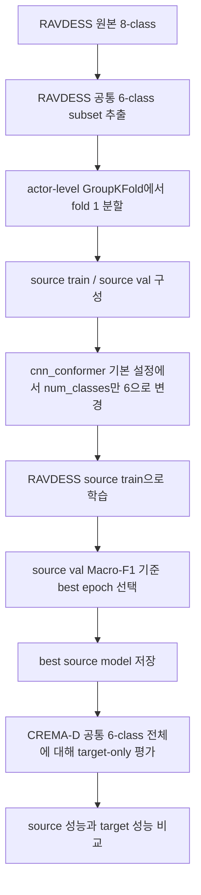

# 교차 코퍼스 실험 기록

## 1. 문서 범위

- 문서 대상 모델명: `cnn_conformer`
- 문서 목적: `RAVDESS -> CREMA-D 6-class source-only baseline`의 실제 실행 결과와 artifact 해석을 기록한다.
- 현재 문서 상태: `active`

본 문서는 계획 문서 [`./KR_CROSS_CORPUS_EXPERIMENT_PLAN.md`](./KR_CROSS_CORPUS_EXPERIMENT_PLAN.md)에 대응하는 실행 결과 기록지다. 실험 목적은 `RAVDESS` 내부에서 선택된 `CNN-Conformer` backbone이 외부 코퍼스인 `CREMA-D`에 대해 어느 정도 일반화되는지 확인하는 것이다.

## 2. 모델 스냅샷

### 2.1 한 줄 요약

현재 실험은 `CNN-Conformer`를 `RAVDESS` 공통 6-class subset으로 학습하고, `CREMA-D` 공통 6-class 전체에 대해 target-only 평가를 수행한 1차 교차 코퍼스 기준선이다.

### 2.2 핵심 구성 요소

| 항목 | 값 또는 설명 |
|---|---|
| 입력 표현 | 128-bin log-Mel |
| 핵심 블록 | `cnn_conformer` |
| 주요 구조 파라미터 | `embed_dim=192`, `num_layers=8`, `num_heads=4`, `ffn_dim=768`, `conv_kernel=31` |
| 출력 pooling | attention pooling |
| 분류 대상 | `neutral`, `happy`, `sad`, `angry`, `fearful`, `disgust` |

### 2.3 비교 관점

- 비교 대상은 `RAVDESS` 내부 source validation 성능과 `CREMA-D` target 성능의 차이다.
- 이 실험은 domain adaptation이 없는 `source-only baseline`이다.

## 3. 실험 라운드 기록

### 3.1 공통 고정 조건

| 분류 | 항목 | 값 | 비고 |
|---|---|---|---|
| source | 데이터셋 | `RAVDESS` 6-class subset | `neutral`, `happy`, `sad`, `angry`, `fearful`, `disgust` |
| target | 데이터셋 | `CREMA-D` 6-class subset | 동일 6-class |
| log-Mel | `n_mels / n_fft / hop_length` | `128 / 1024 / 512` | resolved config 기준 |
| 학습 | `epochs / early_stopping` | `30 / 10` | source fold 기준 |
| 평가 | 지표 | `Accuracy / Macro-F1 / UAR` | source, target 모두 동일 |

### 3.2 탐색 공간 또는 실험 변수

| 항목 | 후보군 | 비고 |
|---|---|---|
| backbone | `cnn_conformer` | 고정 |
| protocol | `source-only` | target tuning 없음 |
| folds | `source_folds=5`, `folds_to_run=1` | 이번 run은 1 fold만 실행 |
| target batch size | `16` | 고정 |

### 3.3 실행 명령

```powershell
.\.venv\Scripts\python.exe -m src.cross_corpus_eval model=cnn_conformer cross_corpus.enabled=true cross_corpus.protocol=ravdess_to_cremad_6class experiment.name=cross_corpus_cremad6 experiment.tag=source_only_6class
```

### 3.3.1 실제 실행 흐름

이번 run의 실제 흐름은 아래와 같다.



\noindent
중요한 점은, 이번 run이 기존 clean 실험에서 얻은 `RAVDESS 8-class 최고 checkpoint`를 직접 불러와 `CREMA-D`에 바로 평가한 실험은 아니라는 것이다. 실제 코드는 `cnn_conformer` 구조를 새로 초기화하고, `num_classes=6`으로 바꾼 뒤 `RAVDESS` 공통 6-class subset에서 다시 학습했다. 이후 source validation에서 선택된 best epoch 모델을 사용해 `CREMA-D` 공통 6-class 전체를 평가했다.

\noindent
따라서 이번 결과는 다음 질문에 답하는 실험으로 해석하는 편이 맞다. 현재 `cnn_conformer` 기본 구조가 `RAVDESS 6-class source-only training` 조건에서 학습된 뒤, 별도의 adaptation 없이 `CREMA-D 6-class`로 이동하면 어느 정도 유지되는가. 반대로, 기존 `RAVDESS 8-class 최고 성능 모델`을 그대로 옮겨 평가한 결과로 해석하면 실제 실행 흐름과 맞지 않는다.

### 3.4 회차별 실험 로그

| 회차 | 날짜 | 목적 | 설정 요약 | 결과 요약 | 산출 경로 |
|---|---|---|---|---|---|
| Round 1 | 2026-04-30 | `RAVDESS -> CREMA-D` 6-class 기준선 측정 | `source-only`, fold 1 실행 | source validation은 중간 수준, target 성능은 크게 하락 | `../../outputs/2026-04-30/18-10-12_cross_corpus_cremad6/` |

### 3.5 주요 결과 요약

| Rank | Fold | Source Macro-F1 | Source Accuracy | Source UAR | Target Macro-F1 | Target Accuracy | Target UAR | 핵심 설정 |
|---|---|---:|---:|---:|---:|---:|---:|---|
| 1 | 1 | 0.56897 | 0.58182 | 0.58333 | 0.09243 | 0.19377 | 0.18936 | `RAVDESS -> CREMA-D`, source-only, 6-class |

추가 관찰:

- `best_epoch = 20`
- source validation `ECE = 0.22191`
- target `ECE = 0.56109`

## 4. 설계 배경 및 구현 메모

### 4.1 설계 배경

교차 코퍼스 실험의 목적은 backbone 자체가 코퍼스 이동에 대해 어느 정도 견디는지 확인하는 것이다. 현재 실험은 adaptation이 없는 기준선이므로, target 성능 하락 폭을 통해 코퍼스 간 발화 방식, 녹음 조건, 감정 표현 강도, 라벨 분포 차이가 어느 정도 크게 작용하는지 확인하는 데 의미가 있다.

### 4.2 현재 코드 기준 구현

- 계획 문서: [`./KR_CROSS_CORPUS_EXPERIMENT_PLAN.md`](./KR_CROSS_CORPUS_EXPERIMENT_PLAN.md)
- 실행 엔트리포인트: [`../../src/cross_corpus_eval.py`](../../src/cross_corpus_eval.py)
- 데이터셋 로더: [`../../src/data/cross_corpus_dataset.py`](../../src/data/cross_corpus_dataset.py)
- 교차 코퍼스 설정: [`../../src/configs/cross_corpus/default.yaml`](../../src/configs/cross_corpus/default.yaml)
- 모델 설정: [`../../src/configs/model/cnn_conformer.yaml`](../../src/configs/model/cnn_conformer.yaml)

### 4.3 구현상 차이점 또는 주의점

- 이번 run은 `folds_to_run=1`이라서 full 5-fold 평균이 아니다.
- source validation best epoch로 target을 평가했으며, target label을 이용한 구조 탐색이나 early stopping은 하지 않았다.
- `RAVDESS` 8-class 전체가 아니라 `CREMA-D`와 공통인 6-class만 사용했다.
- 기존 clean 실험에서 얻은 최고 성능 `CNN-Conformer winner checkpoint`를 직접 재사용한 것이 아니다.
- 이번 run은 `resolved_config.yaml` 기준으로 `cnn_conformer` 기본 설정을 사용했고, classifier 출력 차원만 6으로 바꾼 뒤 source dataset에서 새로 학습했다.

## 5. 아티팩트 분석

### 5.1 대표 run

- run root: [`../../outputs/2026-04-30/18-10-12_cross_corpus_cremad6/`](../../outputs/2026-04-30/18-10-12_cross_corpus_cremad6/)
- resolved config: [`../../outputs/2026-04-30/18-10-12_cross_corpus_cremad6/resolved_config.yaml`](../../outputs/2026-04-30/18-10-12_cross_corpus_cremad6/resolved_config.yaml)
- fold summary: [`../../outputs/2026-04-30/18-10-12_cross_corpus_cremad6/artifacts/cross_corpus_fold_summary.csv`](../../outputs/2026-04-30/18-10-12_cross_corpus_cremad6/artifacts/cross_corpus_fold_summary.csv)
- summary json: [`../../outputs/2026-04-30/18-10-12_cross_corpus_cremad6/artifacts/cross_corpus_summary.json`](../../outputs/2026-04-30/18-10-12_cross_corpus_cremad6/artifacts/cross_corpus_summary.json)
- log: [`../../outputs/2026-04-30/18-10-12_cross_corpus_cremad6/cross_corpus_eval.log`](../../outputs/2026-04-30/18-10-12_cross_corpus_cremad6/cross_corpus_eval.log)

대표 artifact:

- source confusion matrix: [`../../outputs/2026-04-30/18-10-12_cross_corpus_cremad6/artifacts/fold_1/source_val_confusion_matrix.png`](../../outputs/2026-04-30/18-10-12_cross_corpus_cremad6/artifacts/fold_1/source_val_confusion_matrix.png)
- target confusion matrix: [`../../outputs/2026-04-30/18-10-12_cross_corpus_cremad6/artifacts/fold_1/target_confusion_matrix.png`](../../outputs/2026-04-30/18-10-12_cross_corpus_cremad6/artifacts/fold_1/target_confusion_matrix.png)
- source calibration: [`../../outputs/2026-04-30/18-10-12_cross_corpus_cremad6/artifacts/fold_1/source_val_calibration_curve.png`](../../outputs/2026-04-30/18-10-12_cross_corpus_cremad6/artifacts/fold_1/source_val_calibration_curve.png)
- target calibration: [`../../outputs/2026-04-30/18-10-12_cross_corpus_cremad6/artifacts/fold_1/target_calibration_curve.png`](../../outputs/2026-04-30/18-10-12_cross_corpus_cremad6/artifacts/fold_1/target_calibration_curve.png)
- source ROC/PR: [`../../outputs/2026-04-30/18-10-12_cross_corpus_cremad6/artifacts/fold_1/source_val_roc_pr_curves.png`](../../outputs/2026-04-30/18-10-12_cross_corpus_cremad6/artifacts/fold_1/source_val_roc_pr_curves.png)
- target ROC/PR: [`../../outputs/2026-04-30/18-10-12_cross_corpus_cremad6/artifacts/fold_1/target_roc_pr_curves.png`](../../outputs/2026-04-30/18-10-12_cross_corpus_cremad6/artifacts/fold_1/target_roc_pr_curves.png)

### 5.2 항목별 해석

- 관찰 사실: source validation은 `Macro-F1 0.56897`, `Accuracy 0.58182`, `UAR 0.58333`까지 올라갔다.
  - 구조적 해석: source 내부에서는 최소한 6-class 감정 경계를 어느 정도 형성하고 있다. 즉 backbone이 완전히 학습 실패한 상태는 아니다.
- 관찰 사실: target `CREMA-D`에서는 `Macro-F1 0.09243`, `Accuracy 0.19377`, `UAR 0.18936`으로 크게 하락했다.
  - 구조적 해석: 현재 `CNN-Conformer` source-only 기준선은 코퍼스 이동에 매우 민감하다. 감정 범위를 6-class 공통 집합으로 맞추더라도, `RAVDESS`에서 형성된 표현이 `CREMA-D` 발화 조건에 직접 이전되지 않았다.
- 관찰 사실: source validation `ECE 0.22191`에서 target `ECE 0.56109`로 크게 증가했다.
  - 구조적 해석: target에서 예측 정확도뿐 아니라 confidence calibration도 함께 무너졌다. 이는 단순 분류 경계 문제를 넘어서, 모델의 확신 자체가 target 분포에 맞지 않는다는 신호로 볼 수 있다.
- 관찰 사실: `best_epoch`는 20이고, `history.json` 기준으로 train F1은 후반부에 `0.9+`까지 상승했지만 validation F1은 `0.56` 부근에서 정체됐다.
  - 구조적 해석: source 내부에서도 이미 과적합 징후가 있었고, 이 상태에서 target으로 넘어가면 성능 붕괴가 더 크게 나타난다.
- 관찰 사실: source 데이터는 `1056`개, target 데이터는 `7442`개로 규모 차이가 크다.
  - 구조적 해석: 이번 결과는 단순히 target이 더 어려운 것만이 아니라, source corpus의 연기 방식과 target corpus의 연기/녹음 분포 차이가 크게 작용했을 가능성을 보여준다.

## 6. 종합 인사이트 및 다음 액션

### 6.1 현재 판단

현재 `RAVDESS -> CREMA-D` 6-class source-only 결과는 교차 코퍼스 일반화가 매우 약하다는 점을 분명하게 보여준다. 이번 run은 `fold 1` 단일 실행이지만, source validation과 target 성능의 차이가 매우 커서 “코퍼스 이동이 쉽지 않다”는 방향성 자체는 이미 충분히 드러난다.

이번 결과가 의미하는 바는 다음에 가깝다.

- 현재 `CNN-Conformer` backbone은 `RAVDESS` 내부 비교에서는 유효했지만
- 외부 코퍼스로 넘어가면 발화 스타일, 녹음 환경, 감정 표현 분포 변화에 취약하다
- 즉, clean in-corpus 성능과 cross-corpus 성능은 별개 문제로 다뤄야 한다

\noindent
다만 이번 결과만으로 `CNN-Conformer backbone 자체가 약하다`고 바로 결론내리기는 이르다. 이유는 다음과 같다.

- 이번 run은 `fold 1` 단일 실행이다.
- `RAVDESS 8-class winner`를 그대로 이전한 실험이 아니라, `RAVDESS 6-class subset`으로 다시 학습한 실험이다.
- 구조 역시 기존 in-corpus 최고 설정을 정확히 복제한 실험이 아니라, 현재 `cnn_conformer` 기본 설정을 기준으로 실행되었다.

\noindent
따라서 이번 결과는 “현재 source-only baseline 설계에서 cross-corpus 일반화가 매우 약했다”는 해석에는 충분하지만, “CNN-Conformer 전체 접근이 무의미하다”는 해석까지 바로 확장하기에는 아직 이르다. 더 정확한 분리는 다음 두 경우를 나눠서 생각해야 한다.

- 설계 요인: `winner backbone`이 아니라 `기본 cnn_conformer 설정`으로 다시 학습했고, `fold 1`만 실행했다.
- 모델 요인: source 내부에서도 validation이 `0.56` 수준에 머물렀고, target에서는 `0.09`까지 내려가서 현재 구조가 코퍼스 이동에 취약한 것은 분명하다.

### 6.2 다음 액션

- 우선 `folds_to_run=5`로 전체 source fold 평균을 한 번 더 확보
- 이후에도 target 성능이 매우 낮으면, 계획 문서에서 정리한 대로
  - domain adaptation 없이 유지하고 논문에서 “source-only baseline”으로만 사용하거나
  - 후속 실험으로 feature normalization / corpus-invariant regularization / adaptation을 검토
- 논문 서술에서는 이번 결과를 “현재 backbone의 교차 코퍼스 민감도 확인용 기준선”으로 두는 편이 적절

## 7. 변경 이력

| 날짜 | 변경 내용 |
|---|---|
| 2026-04-30 | `RAVDESS -> CREMA-D 6-class` source-only baseline 결과 기록 및 artifact 해석 추가 |
